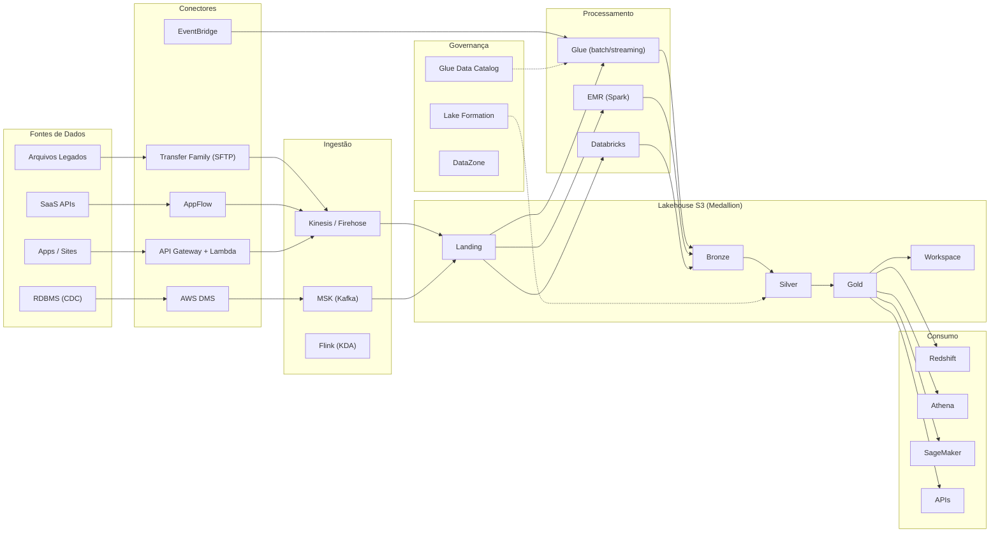
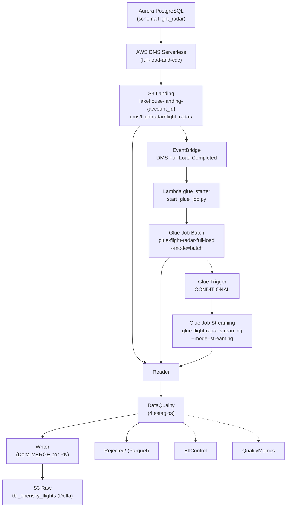
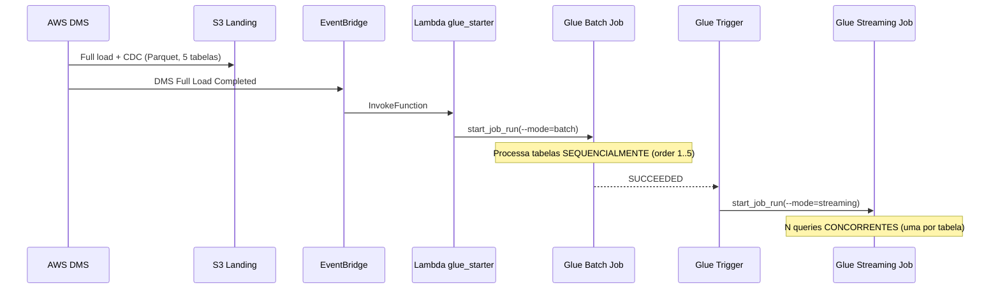

**Summary:** **Technical document ready for data engineers** detailing AWS architecture (medallion), batch/CDC/streaming flows, DDL examples, Glue job, minimal IAM policy and Terraform snippet; **date:** 28-06-2026; **version:** v2.0.

# AWS Data Architecture — Technical Detail for Data Engineers  
**Author:** Jamil  
**Date:** 28-06-2026  
**Version:** v2.0

## 1 Executive Overview
**Objective:** AWS Data Lakehouse platform that supports hybrid ingestion (batch, CDC, streaming), layered curation (Landing → Bronze → Silver → Gold → Workspace) and consumption by BI/ML. **Audience:** data engineers responsible for implementation and operation.

## 2 Components and Responsibilities
- **Sources:** RDBMS (CDC), legacy files, SaaS APIs, apps/sites.  
- **Connectors:** DMS (CDC), Transfer Family (SFTP), AppFlow, API Gateway + Lambda, EventBridge.  
- **Ingestion:** Kinesis / Firehose, MSK (Kafka), Flink (KDA).  
- **Lakehouse (S3):** **Landing**, **Bronze**, **Silver**, **Gold**, **Workspace**.  
- **Processing:** Glue (batch/streaming), EMR (Spark for >10TB), Databricks (notebooks/Delta).  
- **Governance:** DataZone, Glue Data Catalog, Lake Formation.  
- **Consumption:** Redshift, Athena, SageMaker, APIs.  
- **Security/Observability:** IAM, KMS, Secrets Manager, CloudWatch, DataDog, Terraform (IaC).

## 3 Flows and Patterns
- **Batch:** Transfer → S3 Landing → Glue Batch/EMR → Bronze → Silver → Gold.  
- **CDC:** RDBMS → DMS → MSK/Kinesis → stream processors → Bronze→Silver.  
- **Streaming:** App/API → API Gateway/Lambda → Kinesis → Flink/Glue Streaming → Bronze.  
**Patterns:** medallion pattern; event-driven; CDC with idempotency; schema evolution via Glue Catalog.

## 4 Modeling and Best Practices
- **Partitioning:** `ingestion_date` and `event_date`.  
- **Format:** **Parquet** + **Snappy** (batch) / **Delta Lake** (streaming CDC).  
- **Practices:** partition pruning, periodic compaction, small-file mitigation, Delta MERGE for cross-batch dedup.

**DDL Example (Gold)**
```sql
CREATE TABLE gold.events (
  event_id STRING,
  user_id STRING,
  event_type STRING,
  event_time TIMESTAMP,
  payload MAP<STRING,STRING>,
  source_system STRING,
  ingestion_time TIMESTAMP
)
PARTITIONED BY (ingestion_date DATE)
STORED AS PARQUET;
```

## 5 Glue Job Examples (PySpark)
```python
from pyspark.sql import SparkSession

spark = SparkSession.builder \
    .appName("streaming-minibatch-dms") \
    .config("spark.sql.adaptive.enabled", "true") \
    .getOrCreate()

df = spark.readStream.format("parquet") \
    .option("maxFilesPerTrigger", 1) \
    .load("s3://bucket/landing/flights/")

def write_batch(df, epoch_id):
    df.write.format("delta") \
        .mode("append") \
        .save("s3://bucket/raw/flights/")

df.writeStream \
    .trigger(processingTime="60 seconds") \
    .foreachBatch(write_batch) \
    .option("checkpointLocation", "s3://bucket/checkpoints/flights/") \
    .start() \
    .awaitTermination()
```
**Idempotency:** use Delta MERGE based on composite PK to ensure cross-batch uniqueness (no need for `dropDuplicates`).

## 6 Orchestration and Observability
- **Orchestration:** Airflow (DAGs), EventBridge, Step Functions.  
- **Essential metrics:** throughput, consumer lag, job duration, data quality score.  
- **Alerts:** lag > threshold, job failures, quality regression; integrate PagerDuty/Slack.

## 7 Security and Governance
- **IAM least-privilege**, **SSE‑KMS**, Secrets Manager, Lake Formation for column/row control.  
- **PII Masking** in Silver layer; retention and audit policies via CloudTrail.

## 8 SLAs, Costs and Optimizations
- **Streaming SLA:** <30s end‑to‑end; **daily batch:** 2–4h.  
- **Optimizations:** lifecycle (Landing 30d → Glacier), spot instances EMR, partition pruning, compaction.

## 9 Risks and Recommendations
- Mitigate single-point-of-failure in topics; implement DLQs, exponential retries, canary jobs; IaC mandatory.

## 10 Roadmap (phases)
1. Foundations (S3, KMS, Catalog). 2. Batch ingestion. 3. Streaming + CDC. 4. Silver/Gold curation. 5. Consumption and ML. 6. Observability and cost.

## Appendices

**Minimal IAM policy (Glue job)**
```json
{
  "Version":"2012-10-17",
  "Statement":[
    {"Effect":"Allow","Action":["s3:GetObject","s3:ListBucket"],"Resource":["arn:aws:s3:::my-bucket-bronze","arn:aws:s3:::my-bucket-bronze/*"]},
    {"Effect":"Allow","Action":["s3:PutObject"],"Resource":["arn:aws:s3:::my-bucket-silver/*"]},
    {"Effect":"Allow","Action":["kms:Decrypt","kms:Encrypt"],"Resource":["arn:aws:kms:region:acct:key/key-id"]}
  ]
}
```

**Terraform snippet (S3 + lifecycle + KMS)**
```hcl
resource "aws_kms_key" "data" { description = "S3 KMS key" }
resource "aws_s3_bucket" "data" { bucket = "my-bucket" }
resource "aws_s3_bucket_lifecycle_configuration" "lc" {
  bucket = aws_s3_bucket.data.id
  rule {
    id = "landing-lifecycle"
    status = "Enabled"
    filter { prefix = "landing/" }
    transition { days = 30, storage_class = "GLACIER" }
  }
}
```

**Diagrama de Arquitetura (Mermaid)**



**Fluxo da Solução (Mermaid)**



**Fluxo de Eventos (Mermaid)**



---  
**Fim do documento.** Salve como `arquitetura-aws-detalhamento-engenheiros.md`.