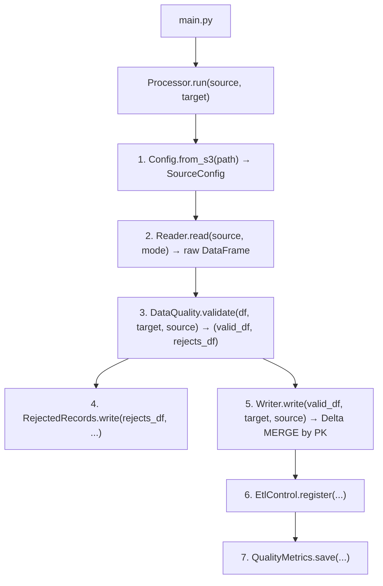

# Feature: Glue Streaming Mini-Batch with DMS CDC

## 1. Description

**AWS Glue 5.0 (PySpark 4.0)** job to process Change Data Capture (CDC) data replicated by **AWS DMS Serverless** in the **landing** bucket, apply quality rules and store in the **Data Lake** (raw layer) in **Delta Lake** format, partitioned and cataloged in **Glue Data Catalog**.

> ⚠️ **Pure Spark:** The job does **not** use Glue APIs (`GlueContext`, `DynamicFrame`, `Job`, `getResolvedOptions`). All processing is done with pure SparkSession.

## 2. Context

AWS DMS Serverless continuously replicates data from an Aurora PostgreSQL source to the S3 landing bucket in Parquet format. Files are organized by table folder and date (`YYYY/MM/DD/`), with operation column (`Op`) and DMS timestamp (`dms_timestamp`).

The Glue Job processes these files in two modes:
- **Batch (full load):** processes all tables sequentially via a Glue workflow on-demand trigger
- **Streaming (CDC):** processes each table concurrently via a conditional trigger after the batch succeeds

Ensuring:
- Batch read + streaming read with S3 checkpoint (`cleanSource=archive`) — **no job bookmarks**
- Data validation and cleansing (type casting, nulls, enums)
- Write to raw bucket in **Delta Lake** with **MERGE by PK** for cross-batch uniqueness
- Quality metrics tracking via `QualityMetrics`
- Execution log in control table via `EtlControl`
- Centralized rejected records via `RejectedRecords`

## 3. Data Source (config.json)

### Source Configuration (config.json)

Each source carries a full-load prefix (`source_location`) and a CDC-only prefix (`cdc_source_location`) written by DMS via the `CdcPath` parameter:

```json
{
  "source": "aircraft",
  "order": 1,
  "filter": "",
  "source_location": "s3://lakehouse-landing-{account_id}/dms/flightradar/flight_radar/aircraft/LOAD*.parquet",
  "cdc_source_location": "s3://lakehouse-landing-{account_id}/dms/flightradar/flight_radar/aircraft/2*/*/*/*/*.parquet",
  "archive_location": "s3://lakehouse-landing-{account_id}/dms/flightradar/flight_radar/aircraft_archive/",
  "format": "parquet",
  "cdc_config": { "op_column": "Op", "timestamp_column": "dms_timestamp", "delete_strategy": "soft_delete" },
  "checkpoint_location": "s3://lakehouse-workspace-{account_id}/checkpoints/aircraft/",
  "target": { ... }
}
```

### CDC Behavior

- **Full load** (`LOAD*.parquet`): initial snapshot with `Op` = `I`
- **Incremental**: files with maximum interval of **60 seconds**
- `Op` = `I` (insert), `U` (update), `D` (delete)
- `dms_timestamp` marks the moment of change capture
- `pathGlobFilter=2*.parquet` ensures only CDC files are read in streaming mode

## 4. Destination Tables (embedded in config.json)

Each of the 8 sources carries an embedded `target` definition (catalog, schema, partition, PK). Summary:

| Source | Target table | Partition | PK |
|--------|-------------|-----------|-----|
| `aircraft` | `fr_aircraft` | `event_date` | `icao24` |
| `airports` | `fr_airports` | `event_date` | `icao_code` |
| `airlines` | `fr_airlines` | `event_date` | `icao_code` |
| `flights` | `fr_flights` | `event_date` (from `scheduled_departure`) | `flight_id` |
| `aircraft_positions` | `fr_aircraft_positions` | `aircraft_icao24` | `position_id`, `recorded_at` |
| `countries` | `fr_countries` | `event_date` | `id` |
| `aircraft_types` | `fr_aircraft_types` | `event_date` | `icao_code` |
| `routes` | `fr_routes` | `event_date` | `id` |

Example target (embedded in the flights source):

| Column | Type | Description |
|--------|------|-----------|
| `flight_id` | `bigint` | Flight ID (PK) |
| `flight_number` | `string` | Flight number |
| `airline_icao` | `string` | Airline ICAO code (FK) |
| `aircraft_icao24` | `string` | Aircraft ICAO24 address (FK) |
| `origin_airport` | `string` | Origin airport ICAO code |
| `destination_airport` | `string` | Destination airport ICAO code |
| `status` | `string` | Flight status (enum) |
| `created_at` / `updated_at` | `timestamp` | Record timestamps |
| `cod_unique` | `string` | PK concatenation for merge |
| `cdc_operation` | `string` | CDC operation (I/U/D) |

**Format:** Delta Lake. **Dedup:** Delta MERGE (cross-batch, no `row_number()` or `dropDuplicates`).

## 5. Job Structure

### 5.1. Configuration Files (single file)

| File | Content | Class |
|---------|----------|--------|
| `app/aws-glue/src/dependencies/config/config.json` | Unified configuration (source + target) | `Config` |

### 5.2. Classes

| Class | File | Responsibility |
|--------|---------|-----------------|
| `Config` | `config_models.py` | Read config JSON, return `SourceConfig`/`TargetConfig` (dataclasses) |
| `Reader` | `reader.py` | Read Parquet data from S3 in batch or streaming mode |
| `DataQuality` | `data_quality.py` | Validate, cleanse and convert data; record rejections |
| `Writer` | `writer.py` | Write valid data to raw layer (Delta MERGE + bootstrap) |
| `RejectedRecords` | `rejected_records.py` | Write rejected records to centralized table (JSON payload) |
| `EtlControl` | `etl_control.py` | Register execution in `etl_control` |
| `QualityMetrics` | `quality_metrics.py` | Save metrics to `data_quality_metrics` |
| `Processor` | `processor.py` | Orchestrate full pipeline (delegates EtlControl/QualityMetrics) |
| `main.py` | `main.py` | Entry point: init Spark, parse args via argparse, run |
| Lambda handler | `app/aws-lambda/start_workflow/start_glue_job.py` | Starts the full-load Glue workflow (outside the Glue src) |

> All support modules live in `app/aws-glue/src/dependencies/`; the Lambda lives separately in `app/aws-lambda/start_workflow/`.

### 5.3. Infrastructure (Terraform)

| Resource | `infra/` File | Description |
|---------|-----------------|-----------|
| KMS Key | `kms.tf` | KMS key for SSE-KMS/CSE-KMS encryption |
| Security Config | `glue.tf` | Encryption: CloudWatch, job bookmarks, S3 |
| Glue Connection | `glue.tf` | VPC connection (private subnet + security group) |
| Glue Workflow | `glue.tf` | Full load → streaming orchestration |
| Glue Job (batch) | `glue.tf` | Full-load batch job — Glue 5.0 / Spark 4.0 / Python 3.9 |
| Glue Job (streaming) | `glue.tf` | Streaming CDC job — Glue 5.0 / Spark 4.0 / Python 3.9 |
| Glue Triggers | `glue.tf` | ON_DEMAND (batch) + CONDITIONAL (streaming) |
| IAM Role + Policy | `iam.tf` | Lambda → Glue (`glue:StartWorkflowRun`) |
| Lambda Function | `lambda.tf` | Starts the full-load Glue workflow (EventBridge schedule target) |
| EventBridge Rule + Target | `cloudwatch.tf` | Schedule `rate()` — polls DMS task status until full load completes → Lambda |
| DynamoDB Lock Table | `dynamodb.tf` | Lock keyed by task ARN — guarantees single workflow start per full load |
| Archive + S3 Objects | `s3.tf` | Upload of main.py, helpers.zip, config.json and Lambda source to the workspace bucket |

> ⚠️ Glue Catalog databases and tables are not created by Terraform — they already exist in the Data Lake. Names are only for code reference.

#### Dynamic Spark Configs

Spark configs are defined in the Terraform module's `locals.tf` as a `spark_properties` map and converted to a single `--conf` string. `main.py` parses this string and applies each property dynamically to `SparkSession.builder`, eliminating hardcoded values.

Delta Lake specific configs are included: `spark.databricks.delta.optimizeWrite.enabled`, `spark.databricks.delta.autoCompact.enabled`, plus the Delta Spark extension and catalog (`spark.sql.extensions`, `spark.sql.catalog.spark_catalog`).

### 5.4. Pipeline



## 6. Quality Rules (DataQuality)

| Rule | Description | Action for invalid |
|-------|-----------|-------------------|
| Null in PK | PK column null | Reject |
| Enum | Value outside allowed list in `enum_columns` | Reject |
| `timestamp` type | Columns with invalid format | Reject |
| Numeric type | Non-convertible numeric columns | Reject |

> **Note:** Duplicate PK validation is delegated to **Delta MERGE** on write — the `WHEN NOT MATCHED THEN INSERT` clause ensures only records with new PKs are inserted, and `WHEN MATCHED THEN UPDATE` updates existing records. No need for `row_number()` or `dropDuplicates` in the pipeline.

## 7. Support Tables

### 7.1. `etl_control` — Execution Control

| Column | Type | Description |
|--------|------|-----------|
| `execution_id` | `STRING` | Execution UUID |
| `job_name` | `STRING` | Glue Job name |
| `source` | `STRING` | Processed source (e.g. "flights") |
| `execution_start` | `TIMESTAMP` | Execution start |
| `execution_end` | `TIMESTAMP` | Execution end |
| `status` | `STRING` | `running`, `success`, `failed` |
| `records_read` | `BIGINT` | Records read |
| `records_written` | `BIGINT` | Records written to raw |
| `records_rejected` | `BIGINT` | Rejected records |
| `target_partition` | `STRING` | Target partition (e.g. "event_date=") |
| `error_message` | `STRING` | Error message (if any) |
| `reference_date` | `DATE` | Partition (reference date) |

### 7.2. `data_quality_metrics` — Quality Metrics

| Column | Type | Description |
|--------|------|-----------|
| `database` | `STRING` | Evaluated database |
| `table` | `STRING` | Evaluated table |
| `processing_timestamp` | `TIMESTAMP` | Processing timestamp |
| `metric` | `STRING` | Evaluated metric |
| `rule` | `STRING` | Applied rule |
| `status` | `STRING` | `passed`, `failed` |
| `failure_reason` | `STRING` | Failure reason |
| `partition` | `STRING` | Evaluated partition |
| `technology` | `STRING` | Technology (e.g. "glue") |
| `reference_date` | `DATE` | Partition |

### 7.3. `rejected_records` — Centralized Rejected Records

| Column | Type | Description |
|--------|------|-----------|
| `execution_id` | `STRING` | Execution UUID |
| `execution_timestamp` | `TIMESTAMP` | Execution timestamp (America/Sao_Paulo) |
| `source_database` | `STRING` | Source database (e.g. "db_raw") |
| `source_table` | `STRING` | Source table name |
| `target_database` | `STRING` | Target database |
| `target_table` | `STRING` | Target table name |
| `reject_rule` | `STRING` | Validation rule that caused rejection |
| `reject_reason` | `STRING` | Human-readable rejection reason |
| `rejected_record_json` | `STRING` | Full rejected record as JSON |
| `reference_date` | `DATE` | Partition (reference date) |

## 8. Additional Artifacts

| Artifact | Description |
|----------|-----------|
| `tests/unit/` | Unit tests with **pytest** mocking Spark, Glue and AWS |
| `tests/integration/` | Integration tests with **boto3** (S3, Glue Catalog) |
| `infra/` | Complete Terraform module (Glue jobs, workflow, KMS, Security Config, Connection) |
| `ci-cd/deploy.sh` | Bash script for AWS environment setup via Terraform |
| `ci-cd/rollback.sh` | Bash script for AWS environment rollback |
| `app/aws-glue/src/dependencies/config/config.json` | Unified configuration (JSON) |
| `app/aws-lambda/start_workflow/start_glue_job.py` | Lambda that starts the full-load Glue workflow |

## 9. Acceptance Criteria

| # | Criterion | Status |
|---|----------|--------|
| 1 | Job reads Parquet files from DMS in the landing bucket | ✅ |
| 2 | Job processes batch (full load) and streaming (CDC) modes | ✅ |
| 3 | Job uses Glue 5.0 with Spark 4.0 | ✅ |
| 4 | Spark optimization configs applied (AQE, memory, shuffle) | ✅ |
| 5 | Job applies quality rules and rejects invalid records | ✅ |
| 6 | Rejected records are written to the centralized `rejected_records` table | ✅ |
| 7 | Job writes validated data in Delta Lake to the raw bucket | ✅ |
| 8 | Data is partitioned by `event_date` (or `aircraft_icao24`) | ✅ |
| 9 | Target tables registered in Glue Catalog (db_raw) | ✅ |
| 10 | Quality metrics saved to `data_quality_metrics` | ✅ |
| 11 | Execution control registered in `etl_control` (enriched schema) | ✅ |
| 12 | Unit tests with pytest | ✅ |
| 13 | Integration tests with boto3 validate S3 and Glue Catalog | ✅ |
| 14 | `deploy.sh` and `rollback.sh` scripts functional | ✅ |
| 15 | Terraform module `infra/` with KMS, Security Config, Connection and jobs | ✅ |
| 16 | Glue job associated with security configuration and VPC connection | ✅ |

## 10. Dependencies

- Bucket S3 `lakehouse-landing-{account_id}` with DMS data for `flight_radar` tables
- Bucket S3 `lakehouse-raw-{account_id}` for writing
- Bucket S3 `lakehouse-workspace-{account_id}` for scripts, configs and checkpoints
- Role IAM `role-glue-job-flight-radar` (dedicated, created by the `infra/` module)
- Default VPC with private subnets and default security group
- KMS key for encryption (created by the `infra/` module)
- Glue Catalog database `db_raw` (already exists in the Data Lake, not created by the `infra/` module)

### Deployment Structure (Workspace Bucket)

```
lakehouse-workspace-{account_id}/
├── aws-glue/jobs/flight-radar/src/
│   ├── main.py
│   └── dependencies/
│       ├── helpers.zip
│       └── config/config.json
└── aws-lambda/flight-radar/start_workflow/
    └── start_glue_job.py
```