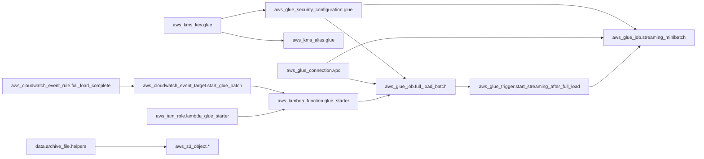
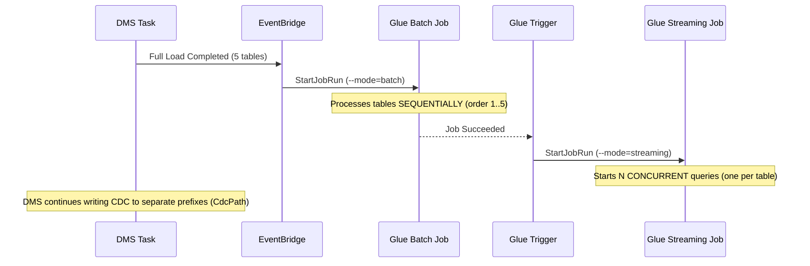

# Implementation Plan

> Generated from `spec.md`. Status: **migrated to Delta Lake — dual mode (batch + streaming)**.

## Project Structure

```
app/
├── src/
│   ├── main.py              # Glue Job entry point (argparse, dynamic --conf, --mode batch|streaming)
│   ├── __init__.py
│   └── dependencies/        # Support modules (packaged as helpers.zip)
│       ├── __init__.py
│       ├── config/          # Configuration dataclasses + JSONs (sub-package)
│       │   ├── __init__.py  #   → Config, SourceConfig, TargetConfig, etc.
│       │   └── config.json  #   → Unified configuration (all tables with source + target)
│       ├── reader.py        # Streaming and batch data reader (Reader)
│       ├── data_quality.py  # Validation and quality (DataQuality) — 4 stages
│       ├── writer.py        # Data Lake write (Writer) — Delta Lake
│       ├── processor.py     # Orchestrator (Processor)
│       ├── etl_control.py   # Execution log in etl_control
│       ├── quality_metrics.py # Quality metrics in data_quality_metrics
│       └── aws_helper.py    # Reusable boto3 utility (AwsHelper)
└── tests/                    # Unit and integration tests
    ├── __init__.py
    ├── conftest.py            # Adds app/ to sys.path
    ├── unit/
    │   ├── __init__.py
    │   ├── test_config.py
    │   ├── test_reader.py
    │   ├── test_data_quality.py
    │   ├── test_writer.py
    │   └── test_processor.py
    └── integration/
        ├── __init__.py
        ├── conftest.py
        ├── test_s3_landing.py
        ├── test_glue_catalog.py
        └── test_pipeline_e2e.py
infra/                     # Complete Terraform module
├── main.tf               # Module overview (no resources)
├── kms.tf                # KMS key + alias (encryption)
├── glue.tf               # Glue security config, VPC connection, jobs, trigger
├── iam.tf                # IAM role + policy (Lambda → Glue)
├── lambda.tf             # Lambda function + permission (starts full-load job)
├── cloudwatch.tf         # EventBridge rule + target (DMS full load complete)
├── s3.tf                 # Artifact upload (main.py, helpers.zip, config.json)
├── variables.tf          # Input variables
├── outputs.tf            # Module outputs
├── data.tf               # Data sources (VPC, IAM Role, Subnets, SG)
├── locals.tf             # Computed locals (buckets, spark_conf)
├── versions.tf           # Provider versions
└── terraform.tfvars      # Default variable values
scripts/
├── setup-env.sh          # AWS environment setup via Terraform (upload via null_resource)
└── rollback-setup.sh     # AWS environment rollback (no S3 cleanup)
docs-sdd/
├── skill.md              # Skill document (updated v3)
├── feature.md            # Feature document (updated v3)
├── prd.md                # PRD document (updated v3)
├── agents.md             # Agents document (updated v3)
├── spec.md               # Specification (new — from agents + PRD)
├── plan.md               # Implementation plan (updated — from spec)
├── arquitetura.md        # Data Lake overall architecture
├── schema_source_files.md # DMS source schemas
├── structure_source_directory.md # Landing bucket structure
└── feature_skill.txt     # Initial feature specification
```

## Configuration (JSON)

### `app/src/dependencies/config/config.json` — Unified configuration (all tables)
```json
[
  {
    "source": "flights",
    "source_location": "s3://lakehouse-landing-{account_id}/dms/flightradar/flight_radar/flights/",
    "format": "parquet",
    "cdc_config": { "op_column": "Op", "timestamp_column": "dms_timestamp", "delete_strategy": "soft_delete" },
    "checkpoint_location": "s3://lakehouse-workspace-{account_id}/checkpoints/flights/"
  },
  {
    "source": "flights_cdc",
    "source_location": "s3://lakehouse-landing-{account_id}/dms/flightradar/flight_radar/flights_cdc/",
    "format": "parquet",
    "cdc_config": { "op_column": "Op", "timestamp_column": "dms_timestamp", "delete_strategy": "soft_delete" },
    "checkpoint_location": "s3://lakehouse-workspace-{account_id}/checkpoints/flights_cdc/"
  }
]
```

> **Note:** The `flights` source is used for **batch full load** (G.1X, 4 workers).
> The `flights_cdc` source is used for **streaming CDC** (G.0.25X, 1 worker).
> DMS `CdcPath` parameterizes the S3 prefix for CDC files, ensuring the streaming job does not reprocess full load files.

### `app/src/dependencies/config/config.json` — Target configuration (embedded in each source)
```json
{
  "catalog": { "database": "db_raw", "table": "tbl_opensky_flights" },
  "location": "s3://lakehouse-raw-{account_id}/tables/opensky/flights/",
  "rejected_location": "s3://lakehouse-landing-{account_id}/dms/flightradar/flight_radar/Rejected/",
  "format": "delta",
  "compression": "snappy",
  "partition_keys": [{ "name": "event_date", "type": "date" }],
  "schema": [
    { "name": "icao24", "type": "string", "comment": "ICAO24 aircraft code" },
    { "name": "callsign", "type": "string", "comment": "Flight callsign" },
    { "name": "origin_country", "type": "string", "comment": "Country of origin" },
    { "name": "latitude", "type": "double", "comment": "Latitude" },
    { "name": "longitude", "type": "double", "comment": "Longitude" },
    { "name": "altitude", "type": "double", "comment": "Altitude in feet" },
    { "name": "velocity", "type": "double", "comment": "Speed in m/s" },
    { "name": "heading", "type": "double", "comment": "Direction in degrees" },
    { "name": "last_contact", "type": "bigint", "comment": "Last contact (epoch)" },
    { "name": "event_time", "type": "string", "comment": "Event timestamp" },
    { "name": "location", "type": "string", "comment": "Location" },
    { "name": "cod_unico", "type": "string", "comment": "PK concatenation (icao24_event_time)" }
  ],
  "primary_key": ["icao24", "event_time"],
  "cod_unico_expr": { "columns": ["icao24", "event_time"], "separator": "_" },
  "enum_columns": {}
}
```

## Core Module Implementation

### `config.py` — Config Class with dataclasses

**Dataclasses:**
| Class | Fields |
|--------|--------|
| `SchemaField` | name, type, comment, nullable |
| `PartitionKey` | name, type |
| `CdcConfig` | op_column, timestamp_column, order |
| `SourceConfig` | source, source_location, format, cdc_config, checkpoint_location |
| `TargetConfig` | catalog, location, rejected_location, format, compression, partition_keys, schema, primary_key, enum_columns, cod_unico_expr |
| `Config` | `_sources: List[SourceConfig]`, `source` (property → first), `sources` (property → all), `get_source(name)` (method), `from_files()`, `from_s3()`, `to_dict()` |

> **v4 Change:** `Config` now supports multiple sources. The `source` (singular) field was replaced by `_sources` (list). The `source` property maintains backward compatibility by returning the first source. The `get_source(name)` method allows selecting a source by name.

### `reader.py` — Reader Class (streaming + batch)
- **Streaming:** `spark.readStream.format("parquet")` with `maxFilesPerTrigger=1`, `cleanSource=archive`, `includeExistingFiles=true`
- **Batch:** `spark.read.format("parquet").load(source.source_location)` — reads all existing files at once
- Checkpoint at `source.checkpoint_location` (streaming only)
- Method `read(source, mode="streaming")` — dispatcher to `_read_streaming` or `_read_batch`

### `aws_helper.py` — AwsHelper Class (new)
- Reusable boto3 utility, decoupled from the pipeline
- Lazy clients: `s3`, `athena`, `glue`, `sts`, `cloudwatch`
- `get_account_id()` → returns account ID via STS
- `run_athena_query(spark, query, database, workgroup, location)` → executes Athena query and returns Spark DataFrame
- `move_s3_objects(source_bucket, source_prefix, dest_bucket, dest_prefix, pattern, delete_source)` → moves S3 objects with regex filter
- `put_metric(namespace, metric_name, value, unit, dimensions)` → publishes CloudWatch metric

### `data_quality.py` — DataQuality Class (4 stages)
| Stage | Method | Description |
|-------|--------|-----------|
| 1 | `_cast_types` | Converts columns to target schema types |
| 2 | `_check_nulls` | Removes records with nulls in required fields |
| 3 | `_check_enums` | Validates against allowed list in `enum_columns` |
| 4 | `_validate_timestamps` | Pass-through (reserved) |

> **Note:** The `_remove_duplicates` stage was removed — uniqueness is guaranteed by Delta MERGE on write (Writer).

### `writer.py` — Writer Class
- **Delta Lake** write with `DeltaTable.forName()` via Glue Catalog
- Generates `cod_unico` via `F.concat_ws("_", *pk_cols)` for merge key
- Derives `event_date` via `F.to_date()`
- MERGE: `WHEN NOT MATCHED THEN INSERT` / `WHEN MATCHED THEN UPDATE`
- **No manual compaction** — Delta manages via auto-optimize
- `write_rejects()` with `_reject_table`, `_reject_rule`, `_reject_timestamp` metadata (Parquet format)

### `etl_control.py` — EtlControl Class
- Method `register()` writes to `etl_control`
- Resolves account_id via boto3 STS
- Schema: execution_id, source_name, status, records_read, records_written, records_rejected, elapsed_seconds, error_message

### `quality_metrics.py` — QualityMetrics Class
- Method `save()` writes to `data_quality_metrics`
- Resolves account_id via boto3 STS
- Schema: rows_read, rows_written, rows_rejected, pipeline_status

### `processor.py` — Processor Class
- 6-stage pipeline in method `run(source, target, mode, dataframe)`:
  1. Read via `Reader` (or uses pre-read DataFrame in batch mode)
  2. Validate via `DataQuality` (4 stages — no dedup)
  3. Write rejects via `Writer.write_rejects()`
  4. Write valid data via `Writer` (Delta MERGE by PK)
  5. Register execution via `EtlControl`
  6. Save quality metrics via `QualityMetrics`

> **v4 Change:** The `run()` method accepts `mode` ("streaming" \| "batch") and optional `dataframe`. In batch mode with a pre-read dataframe, the read step is skipped.

### `main.py` — Entry Point (dual mode)
- Argument parsing via `argparse`: `--config_s3_path`, `--conf`, `--mode` (batch\|streaming)
- `_parse_conf()`: converts `"key=val key=val"` string to dict
- `_init_spark()`: applies configs dynamically to `SparkSession.builder`
- `main()`: loads config (`Config.from_s3(args.config_s3_path)`), gets sorted list via `config.sources`, dispatches `_run_batch()` or `_run_streaming()`
- `_run_batch()`: iterates sources in `order`, reads batch of each table and processes via `Processor.run(mode="batch", dataframe=raw_df)`. Errors in one table do not block the others.
- `_run_streaming()`: starts **one streaming query per table**, each with `trigger(processingTime="5 minutes")` and own checkpoint. `awaitTermination()` keeps the job alive.
- **No GlueContext, DynamicFrame, Job, getResolvedOptions**

## Infrastructure as Code (Terraform)

### Resources (organizados por serviço em `infra/`)

| Resource | File | Type | Description |
|---------|------|------|-----------|
| `aws_kms_key.glue` | `kms.tf` | KMS Key | SSE-KMS/CSE-KMS, 30-day rotation |
| `aws_kms_alias.glue` | `kms.tf` | KMS Alias | `alias/glue-streaming-minibatch-dms` |
| `aws_glue_security_configuration.glue` | `glue.tf` | Security Config | CloudWatch SSE-KMS, bookmarks CSE-KMS, S3 SSE-KMS |
| `aws_glue_connection.vpc` | `glue.tf` | Glue Connection | NETWORK, private subnet, default SG |
| `aws_glue_job.full_load_batch` | `glue.tf` | Glue Job (batch) | Glue 5.1, Python 3.10, G.1X, 4 workers, `--mode=batch` — processes N tables sequentially |
| `aws_glue_job.streaming_minibatch` | `glue.tf` | Glue Job (streaming) | Glue 5.1, Python 3.10, G.0.25X, 1 worker, `--mode=streaming` — N concurrent queries |
| `aws_glue_trigger.start_streaming_after_full_load` | `glue.tf` | Glue Trigger | CONDITIONAL — starts streaming CDC after batch succeed |
| `aws_iam_role.lambda_glue_starter` | `iam.tf` | IAM Role | Role for Lambda to start the full-load Glue job |
| `aws_iam_role_policy.lambda_glue_starter` | `iam.tf` | IAM Policy | Permission `glue:StartJobRun` on full_load_batch job |
| `aws_lambda_function.glue_starter` | `lambda.tf` | Lambda Function | Starts the full-load Glue job (EventBridge target) |
| `aws_lambda_permission.eventbridge_invoke_glue_starter` | `lambda.tf` | Lambda Permission | Allows EventBridge to invoke the Lambda |
| `aws_cloudwatch_event_rule.full_load_complete` | `cloudwatch.tf` | EventBridge Rule | DMS full load completed event (source=aws.dms) |
| `aws_cloudwatch_event_target.start_glue_batch` | `cloudwatch.tf` | EventBridge Target | Triggers the Lambda via InvokeFunction |
| `data.archive_file.helpers` + `aws_s3_object.*` | `s3.tf` | Archive + S3 Objects | Declarative — helpers.zip + main.py + JSON configs |

### Diagrama de Infraestrutura (Mermaid)



### Spark Configs (--conf)

Defined in `locals.tf` as `spark_properties` and converted to `spark_conf` string:

- AQE enabled, shuffle=200, 4g executor/driver memory
- Off-heap 2g, dynamic allocation, Snappy compression
- Applied dynamically in `main.py` via `_parse_conf()` + `SparkSession.builder.config()`

### Event Flow



### Scripts

| Script | Function |
|--------|---------------|
| `scripts/setup-env.sh` | Terraform init/apply + artifact upload via `aws_s3_object` |
| `scripts/rollback-setup.sh` | Terraform destroy **without** S3 cleanup |

## Timeline (Completed)

| Phase | Tasks | Status |
|------|---------|--------|
| Phase 1 | Directory structure, config JSON | ✅ Complete |
| Phase 2 | 8 Python module implementations | ✅ Complete |
| Phase 3 | Terraform + S3 upload via null_resource | ✅ Complete |
| Phase 4 | Unit + integration tests | ✅ Complete |
| Phase 5 | setup-env.sh + rollback-setup.sh scripts | ✅ Complete |

## Deliverables

| # | Deliverable | Status |
|---|-----------|--------|
| 1 | `app/src/main.py` + 7 modules in `app/src/dependencies/` (config/ is sub-package) | ✅ |
| 2 | `app/src/dependencies/config/config.json` (unified config with embedded target) | ✅ |
| 3 | `infra/` complete Terraform module (Glue Job, KMS, Security Config, Connection, Upload) | ✅ |
| 4 | `tests/unit/` (100% coverage) | ✅ |
| 5 | `tests/integration/` (boto3) | ✅ |
| 6 | `scripts/setup-env.sh` + `rollback-setup.sh` (no S3 upload in scripts) | ✅ |
| 7 | Pipeline validated and in production | ⏳ Pending |
| 8 | `docs-sdd/` synced with current code | ✅ |
