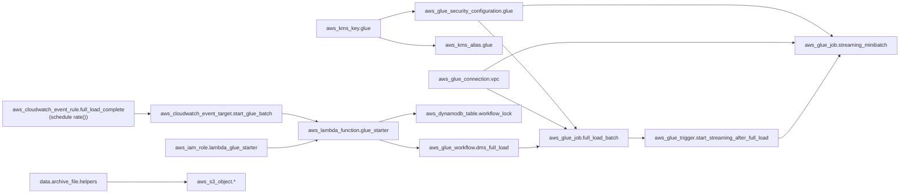
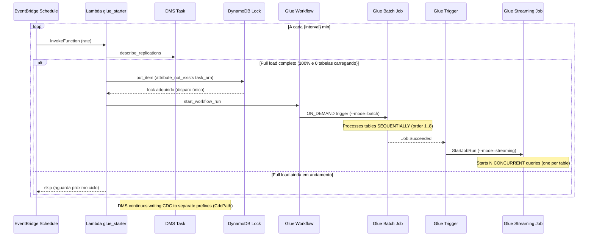

# Implementation Plan

> Generated from `spec.md`.

## Project Structure

```
app/
├── aws-glue/                  # Glue job source + tests
│   ├── src/
│   │   ├── main.py            # Glue Job entry point (argparse, dynamic --conf, --mode batch|streaming)
│   │   ├── __init__.py
│   │   └── dependencies/      # Support modules (packaged as helpers.zip)
│   │       ├── config_models.py # Dataclasses (Config, SourceConfig, TargetConfig, etc.)
│   │       ├── config/        # Configuration sub-package (holds JSON files)
│   │       │   └── config.json  #   → Unified configuration (all tables with source + target)
│   │       ├── reader.py      # Streaming and batch data reader (Reader)
│   │       ├── data_quality.py# Validation and quality (DataQuality) — 4 stages
│   │       ├── writer.py      # Data Lake write (Writer) — Delta Lake
│   │       ├── processor.py   # Orchestrator (Processor)
│   │       ├── etl_control.py # Execution log in etl_control
│   │       ├── quality_metrics.py # Quality metrics in data_quality_metrics
│   │       ├── aws_helper.py  # Reusable boto3 utility (AwsHelper)
│   │       └── rejected_records.py # Centralized rejected records (RejectedRecords)
│   └── tests/                 # Unit and integration tests
│       ├── __init__.py
│       ├── conftest.py        # Adds app/aws-glue to sys.path
│       ├── unit/
│       │   ├── __init__.py
│       │   ├── test_config.py
│       │   ├── test_reader.py
│       │   ├── test_data_quality.py
│       │   ├── test_writer.py
│       │   ├── test_processor.py
│       │   ├── test_rejected_records.py
│       │   └── conftest.py
│       └── integration/
│           ├── __init__.py
│           ├── conftest.py
│           ├── test_s3_landing.py
│           ├── test_glue_catalog.py
│           └── test_pipeline_e2e.py
└── aws-lambda/                # Lambda source (deployed separately from Glue)
    └── start_workflow/
        └── start_glue_job.py  # Lambda that starts the full-load Glue workflow
infra/                     # Complete Terraform module
├── main.tf               # Module overview (no resources)
├── kms.tf                # KMS key + alias (encryption)
├── glue.tf               # Glue security config, VPC connection, jobs, workflow, triggers
├── iam.tf                # IAM roles and policies (Glue + Lambda)
├── lambda.tf             # Lambda function + permission (starts full-load job)
├── cloudwatch.tf         # EventBridge schedule rule + target (polls DMS full load)
├── dynamodb.tf           # Workflow lock table (single start per full load)
├── s3.tf                 # Artifact upload (main.py, helpers.zip, config.json)
├── variables.tf          # Input variables
├── outputs.tf            # Module outputs
├── data.tf               # Data sources (VPC, IAM Role, Subnets, SG)
├── locals.tf             # Computed locals (buckets, spark_conf)
├── versions.tf           # Provider versions
├── terraform.tfvars      # Default variable values (gitignored)
└── terraform.tfvars.example # Template for variable values
ci-cd/
├── deploy.sh             # AWS environment setup via Terraform (artifact upload via aws_s3_object)
└── rollback.sh           # AWS environment rollback (no S3 cleanup)
docs-sdd/
├── skill.md              # Skill document
├── feature.md            # Feature document
├── prd.md                # PRD document
├── agents.md             # Agents document
├── spec.md               # Specification (from agents + PRD)
├── plan.md               # Implementation plan (from spec)
├── arquitetura.md        # Data Lake overall architecture
├── schema_source_files.md # DMS source schemas
├── structure_source_directory.md # Landing bucket structure
```

## Deployment Structure (S3 Workspace Bucket)

The workspace bucket `lakehouse-workspace-{account_id}` mirrors the project
layout. Glue artifacts live under `aws-glue/jobs/flight-radar/` and Lambda
code under `aws-lambda/flight-radar/start_workflow/`:

```
lakehouse-workspace-{account_id}/
├── aws-glue/
│   └── jobs/
│       └── flight-radar/
│           └── src/
│               ├── main.py                          # Glue job script
│               └── dependencies/
│                   ├── helpers.zip                  # Support modules (archive of src/)
│                   └── config/
│                       └── config.json              # Unified configuration (catalog-based references)
└── aws-lambda/
    └── flight-radar/
        └── start_workflow/
            └── start_glue_job.py                    # Lambda source
```

The Glue job is named for a **single objective** (`glue_job_name = glue-flight-radar`).
Two job definitions are derived from it and differentiated by process:
- `glue-flight-radar-batch` — full load (`--mode=batch`)
- `glue-flight-radar-streaming` — streaming CDC (`--mode=streaming`)

The processes are differentiated in code/classes via the `--mode` argument.
The script and config paths are resolved in `infra/locals.tf` as defaults
pointing to the paths above.

## Configuration (JSON)

### `app/aws-glue/src/dependencies/config/config.json` — Unified configuration (all tables)

```json
[
  {
    "source": "aircraft",
    "order": 1,
    "filter": "",
    "source_location": "s3://lakehouse-landing-{account_id}/dms/flightradar/flight_radar/aircraft/LOAD*.parquet",
    "cdc_source_location": "s3://lakehouse-landing-{account_id}/dms/flightradar/flight_radar/aircraft/2*/*/*/*/*.parquet",
    "archive_location": "s3://lakehouse-landing-{account_id}/dms/flightradar/flight_radar/aircraft_archive/",
    "format": "parquet",
    "cdc_config": { "op_column": "Op", "timestamp_column": "dms_timestamp", "delete_strategy": "soft_delete" },
    "checkpoint_location": "s3://lakehouse-workspace-{account_id}/checkpoints/aircraft/",
    "target": {
      "catalog": { "database": "db_raw", "table": "fr_aircraft" },
      "format": "delta",
      "compression": "snappy",
      "partition_keys": [{ "name": "event_date", "type": "date" }],
      "schema": {
        "icao24": { "type": "string", "nullable": false, "comment": "ICAO aircraft address (hex)" },
        "registration": { "type": "string", "nullable": false, "comment": "Aircraft registration/tail number" },
        "aircraft_type": { "type": "string", "nullable": false, "comment": "Aircraft type ICAO code (e.g. B738, A320)" },
        "serial_number": { "type": "string", "nullable": true, "comment": "Manufacturer serial number" },
        "operator_icao": { "type": "string", "nullable": true, "comment": "Operator ICAO code" },
        "operator_name": { "type": "string", "nullable": true, "comment": "Operator name" },
        "year_built": { "type": "int", "nullable": true, "comment": "Year of manufacture" },
        "created_at": { "type": "timestamp", "nullable": false, "comment": "Record creation timestamp" },
        "updated_at": { "type": "timestamp", "nullable": false, "comment": "Record last update timestamp" },
        "cod_unique": { "type": "string", "nullable": true, "comment": "PK concatenation (icao24)" },
        "cdc_operation": { "type": "string", "nullable": true, "comment": "CDC operation (I/U/D)" }
      },
      "primary_key": ["icao24"],
      "cod_unique_expr": { "columns": ["icao24"], "separator": "_" },
      "enum_columns": {}
    }
  }
]
```

> **Note:** Each source uses `source_location` for **batch full load** and
> `cdc_source_location` for **streaming CDC**. DMS `CdcPath` parameterizes the
> S3 prefix for CDC files, ensuring the streaming job does not reprocess full load files.

### Target configuration (embedded in each source)

See the full `config.json` in the source tree for all 8 tables.

## Core Module Implementation

### `config_models.py` — Config Class with dataclasses

**Dataclasses:**

| Class | Fields |
|--------|--------|
| `SchemaField` | name, type, nullable, comment |
| `PartitionKey` | name, type, source_column |
| `CdcConfig` | op_column, timestamp_column, delete_strategy |
| `SourceConfig` | source, order, source_location, cdc_source_location, archive_location, format, filter, cdc_config, checkpoint_location, target |
| `TargetConfig` | catalog, format, compression, partition_keys, schema, primary_key, enum_columns, cod_unique_expr |
| `Config` | `_sources: List[SourceConfig]`, `source` (property → first), `sources` (property → all sorted by order), `get_source(name)` (method), `from_files()`, `from_s3()`, `to_dict()` |

### `reader.py` — Reader Class (batch + streaming)

- **Streaming:** `spark.readStream.format("parquet")` with `maxFilesPerTrigger=1000`, `cleanSource=archive`, `sourceArchiveDir`, `includeExistingFiles=true`, reading `cdc_source_location`, `pathGlobFilter=2*.parquet`
- **Batch:** `spark.read.format("parquet").load(source.source_location)` — reads all existing files at once
- Checkpoint at `source.checkpoint_location` (streaming only)
- Method `read(source, mode="streaming")` — dispatcher to `_read_streaming` or `_read_batch`
- Schema inference for `aircraft_positions` (handles FIXED_LEN_BYTE_ARRAY)
- Filter support via `source.filter`

### `aws_helper.py` — AwsHelper Class

- Reusable boto3 utility, decoupled from the pipeline
- Lazy clients: `s3`, `athena`, `glue`, `sts`, `cloudwatch`
- `get_account_id()` → returns account ID via STS
- `run_athena_query(spark, query, database, workgroup, location)` → executes Athena query and returns Spark DataFrame
- `move_s3_objects(source_bucket, source_prefix, dest_bucket, dest_prefix, pattern, delete_source)` → moves S3 objects with regex filter
- `put_metric(namespace, metric_name, value, unit, dimensions)` → publishes CloudWatch metric
- `get_json_from_s3(s3_path)` → loads and parses JSON from S3
- `get_table_location(database, table)` → gets S3 location of Glue Catalog table
- `update_table_partitions(database, table)` → discovers S3 partitions and creates missing ones via Glue `batch_create_partition`

### `data_quality.py` — DataQuality Class (4 stages)

| Stage | Method | Description |
|-------|--------|-----------|
| 1 | `_cast_types` | Converts columns to target schema types |
| 2 | `_check_nulls` | Removes records with nulls in required fields |
| 3 | `_check_enums` | Validates against allowed list in `enum_columns` |
| 4 | `_validate_timestamps` | Pass-through (reserved) |

> **Note:** Uniqueness is guaranteed by the Delta MERGE on write (Writer).

### `writer.py` — Writer Class

- **Delta Lake** write with `DeltaTable.forName()` resolved via the Glue Data Catalog
- Generates `cod_unique` via `F.concat_ws("_", *pk_cols)` for merge key
- Derives `event_date` via `F.to_date()`
- Bootstraps the Delta table on first write; MERGE on subsequent writes
- Maps DMS CDC columns (`Op` / `dms_timestamp`) to catalog names (`cdc_operation` / `cdc_timestamp`)
- MERGE: `WHEN NOT MATCHED AND Op <> 'D' THEN INSERT` / `WHEN MATCHED AND Op = 'D' THEN DELETE` / `WHEN MATCHED THEN UPDATE`
- **No manual compaction** — Delta manages via auto-optimize
- `write_rejects()` with `_reject_table`, `_reject_rule`, `_reject_timestamp` metadata (Parquet format)
- Partition columns selected from target schema + partition keys

### `rejected_records.py` — RejectedRecords Class

- Centralized rejected records table: `db_raw.rejected_records`
- JSON payload column (`rejected_record_json`) for schema-flexible storage
- Metadata: `execution_id`, `execution_timestamp`, `source_database`, `source_table`, `target_database`, `target_table`, `reject_rule`, `reject_reason`, `reference_date`
- Append-only write to S3 with `partitionBy("reference_date")`
- Updates Glue Catalog partitions after write

### `etl_control.py` — EtlControl Class

- Method `register()` writes to `etl_control`
- Writes to the `db_raw.etl_control` catalog table via `saveAsTable`
- Schema: execution_id, job_name, source, execution_start, execution_end, status, records_read, records_written, records_rejected, target_partition, error_message, reference_date

### `quality_metrics.py` — QualityMetrics Class

- Method `save()` writes to `data_quality_metrics`
- Writes to the `db_raw.data_quality_metrics` catalog table via `saveAsTable`
- Schema: database, table, processing_timestamp, metric, rule, status, failure_reason, partition, technology, reference_date

### `processor.py` — Processor Class

- Pipeline in method `run(source, target, mode, dataframe)`:
  1. Read via `Reader` (or uses pre-read DataFrame in batch mode)
  2. Validate via `DataQuality` (4 stages — no dedup)
  3. Write rejects via `RejectedRecords.write()`
  4. Write valid data via `Writer` (Delta MERGE by PK)
  5. Register execution via `EtlControl`
  6. Save quality metrics via `QualityMetrics`

### `main.py` — Entry Point (dual mode)

- Argument parsing via `argparse`: `--config_s3_path`, `--conf`, `--mode` (batch|streaming), `--generate-test-rejects`
- `_parse_conf()`: converts `"key=val key=val"` string to dict
- `_init_spark()`: uses `SparkSession.builder.appName("glue-flight-radar").getOrCreate()` to attach to runtime session
- `main()`: loads config (`Config.from_s3(args.config_s3_path)`), gets sorted list via `config.sources`, dispatches `_run_batch()` or `_run_streaming()`
- `_run_batch()`: iterates sources in `order`, reads batch of each table and processes via `Processor.run(mode="batch", dataframe=raw_df)`. Fail-fast on first error.
- `_run_streaming()`: starts **one streaming query per table**, each with `trigger(processingTime="5 minutes")` and own checkpoint. `awaitAnyTermination()` keeps the job alive. Fail-fast on any query failure.
- **No GlueContext, DynamicFrame, Job, getResolvedOptions**

## Infrastructure as Code (Terraform)

### Resources (organized by service in `infra/`)

| Resource | File | Type | Description |
|---------|------|-----------|-----------|
| `aws_kms_key.glue` | `kms.tf` | KMS Key | SSE-KMS/CSE-KMS, 30-day rotation |
| `aws_kms_alias.glue` | `kms.tf` | KMS Alias | `alias/glue-flight-radar` |
| `aws_glue_security_configuration.glue` | `glue.tf` | Security Config | CloudWatch SSE-KMS, bookmarks CSE-KMS, S3 SSE-KMS |
| `aws_glue_connection.vpc` | `glue.tf` | Glue Connection | NETWORK, private subnet, default SG |
| `aws_glue_job.full_load_batch` | `glue.tf` | Glue Job (batch) | Glue 5.0, Python 3.9, `--mode=batch` — processes N tables sequentially |
| `aws_glue_job.streaming_minibatch` | `glue.tf` | Glue Job (streaming) | Glue 5.0, Python 3.9, `--mode=streaming` — N concurrent queries |
| `aws_glue_workflow.dms_full_load` | `glue.tf` | Glue Workflow | `glue-flight-radar-batch-workflow` — full load → streaming |
| `aws_glue_trigger.start_full_load` | `glue.tf` | Glue Trigger | ON_DEMAND — starts the batch job on workflow run |
| `aws_glue_trigger.start_streaming_after_full_load` | `glue.tf` | Glue Trigger | CONDITIONAL — starts streaming CDC after batch succeed |
| `aws_iam_role.glue_job` | `iam.tf` | IAM Role | Dedicated role `role-glue-job-flight-radar` for Glue jobs and sessions |
| `aws_iam_role_policy.glue_catalog_connections` | `iam.tf` | IAM Policy | Glue GetConnection/GetConnections |
| `aws_iam_role_policy.glue_catalog_tables` | `iam.tf` | IAM Policy | Glue Catalog tables/partitions access |
| `aws_iam_role_policy.glue_data_access` | `iam.tf` | IAM Policy | S3 (landing, raw, workspace), KMS, CloudWatch Logs, CloudWatch Metrics |
| `aws_iam_role_policy.glue_vpc_networking` | `iam.tf` | IAM Policy | EC2 Describe/Create/Delete Network Interfaces |
| `aws_iam_role_policy.glue_interactive_sessions` | `iam.tf` | IAM Policy | Glue interactive sessions + PassRole |
| `aws_iam_group_policy.interactive_sessions_passrole` | `iam.tf` | IAM Policy | datalake-admins group PassRole for sessions |
| `aws_iam_role.lambda_glue_starter` | `iam.tf` | IAM Role | Role for Lambda to start the full-load workflow |
| `aws_iam_role_policy.lambda_glue_starter` | `iam.tf` | IAM Policy | Glue StartWorkflowRun, DMS DescribeReplications, DynamoDB GetItem/PutItem, CloudWatch Logs |
| `aws_lambda_function.glue_starter` | `lambda.tf` | Lambda Function | Starts the full-load Glue workflow (EventBridge schedule target) |
| `aws_lambda_permission.eventbridge_invoke_glue_starter` | `lambda.tf` | Lambda Permission | Allows EventBridge to invoke the Lambda |
| `aws_cloudwatch_event_rule.full_load_complete` | `cloudwatch.tf` | EventBridge Rule | Schedule `rate()` — polls DMS task status until full load completes |
| `aws_cloudwatch_event_target.start_glue_batch` | `cloudwatch.tf` | EventBridge Target | Triggers the Lambda via InvokeFunction |
| `aws_dynamodb_table.workflow_lock` | `dynamodb.tf` | DynamoDB Table | Lock keyed by task ARN — guarantees single workflow start per full load |
| `data.archive_file.helpers` + `aws_s3_object.*` | `s3.tf` | Archive + S3 Objects | Declarative — uploads main.py, helpers.zip, config.json and Lambda source to the workspace bucket |

### Diagrama de Infraestrutura (Mermaid)



### Spark Configs (--conf)

Defined in `locals.tf` as `spark_properties` and converted to `spark_conf` string:

- AQE enabled, shuffle=200, 4g executor/driver memory
- Off-heap 2g, dynamic allocation, Snappy compression
- Delta auto-optimize (optimizeWrite/autoCompact) + Delta catalog extension
- File discovery optimizations
- Applied dynamically in `main.py` via `_parse_conf()` + `SparkSession.builder.config()`

### Event Flow



### Scripts

| Script | Function |
|--------|---------------|
| `ci-cd/deploy.sh` | Terraform init/apply + artifact upload via `aws_s3_object` |
| `ci-cd/rollback.sh` | Terraform destroy **without** S3 cleanup |

## Timeline

| Phase | Tasks | Status |
|------|---------|--------|
| Phase 1 | Directory structure, config JSON | ✅ Complete |
| Phase 2 | Python module implementations | ✅ Complete |
| Phase 3 | Terraform + S3 upload via `aws_s3_object` resources | ✅ Complete |
| Phase 4 | Unit + integration tests | ✅ Complete |
| Phase 5 | deploy.sh + rollback.sh scripts | ✅ Complete |

## Deliverables

| # | Deliverable | Status |
|---|-----------|--------|
| 1 | `app/aws-glue/src/main.py` + support modules in `app/aws-glue/src/dependencies/` (config/ holds JSON) | ✅ |
| 2 | `app/aws-lambda/start_workflow/start_glue_job.py` (Lambda source, outside the Glue src) | ✅ |
| 3 | `app/aws-glue/src/dependencies/config/config.json` (unified config with embedded target) | ✅ |
| 4 | `infra/` complete Terraform module (Glue jobs, workflow, KMS, Security Config, Connection, Upload) | ✅ |
| 5 | `app/aws-glue/tests/unit/` | ✅ |
| 6 | `app/aws-glue/tests/integration/` (boto3) | ✅ |
| 7 | `ci-cd/deploy.sh` + `ci-cd/rollback.sh` (no S3 upload in scripts) | ✅ |
| 8 | Pipeline validated and in production | ⏳ Pending |
| 9 | `docs-sdd/` synced with current code | ✅ |