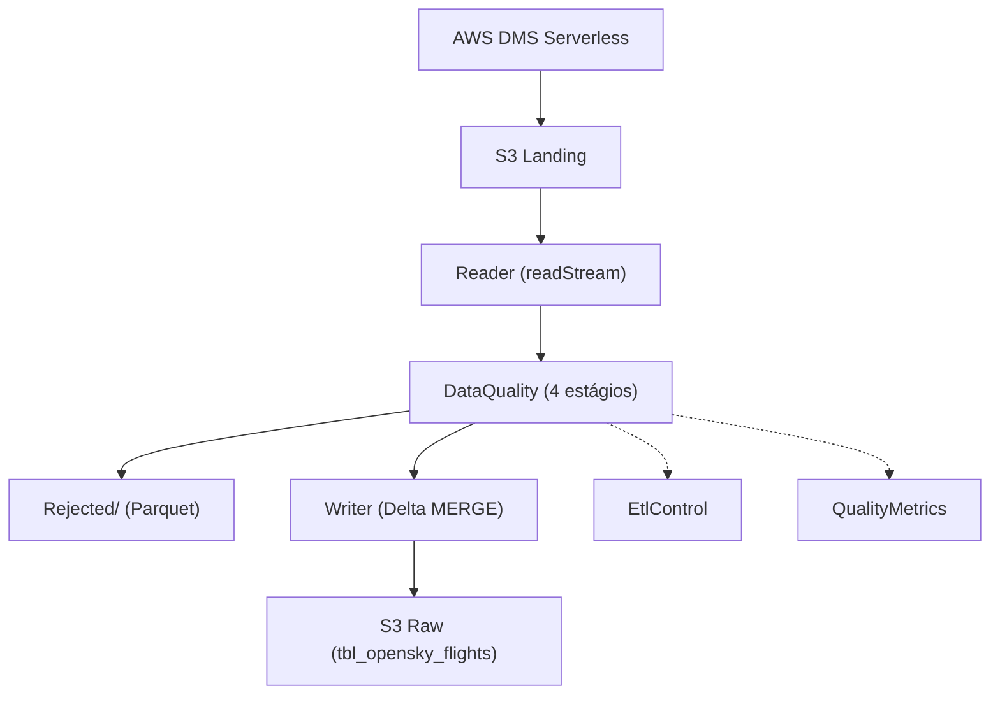

# Product Requirements Document (PRD)

## 1. Objective
Build a **CDC (Change Data Capture)** data processing pipeline for the **`tbl_opensky_flights`** table in the Data Lake, using **AWS Glue 5.1 (PySpark 4.0)** with **streaming mini-batch** processing (pure Spark — no Glue APIs), ensuring quality, traceability and low latency.

## 2. Problem
Data replicated by DMS in the landing bucket needs to be processed before it's ready for analytical consumption. Currently:
- Raw data in the landing bucket without schema validation
- No quality tracking for ingested data
- No rejection process for invalid records
- No checkpointing for processing recovery
- Need for enriched schema for the `etl_control` control table

## 3. Functional Requirements

### FR01 — Streaming Read (no Glue APIs)
- Job must read Parquet files from DMS in the landing bucket
- **Streaming-only** read with `spark.readStream` (no batch support)
- `maxFilesPerTrigger=1` for micro-batch control
- S3 checkpoint via `cleanSource=archive` (no Glue job bookmarks)
- `includeExistingFiles=true` to process historical data

### FR02 — Dynamic JSON Configuration (single file)
- Single JSON file on S3:
  - **config.json**: unified configuration (list of tables, each with embedded source + target)
- Job reads the file at runtime using Python **dataclasses**
- Schema must include types (string, double, bigint, etc.), partition_keys, primary_key, enum_columns

### FR03 — Data Quality (4 stages)
- Validation pipeline with 4 stages:
  1. **Cast types** — converts columns according to target schema
  2. **Null check** — filters nulls in NOT NULL fields
  3. **Enum validation** — validates `enum_columns` values
  4. **Timestamp validation** — validates timestamps
- **No explicit dedup** — uniqueness guaranteed by Delta MERGE on write
- Record quality metrics in `data_quality_metrics` via `QualityMetrics` class

### FR04 — Record Rejection
- Records that fail validation must be saved to `Rejected/`
- Each rejected record must include metadata: `_reject_table`, `_reject_rule`, `_reject_timestamp`

### FR05 — Data Lake Write (Delta Lake)
- Format: **Delta Lake** for valid data (rejects in Parquet)
- Partitioning by `event_date` (derived from timestamp column)
- Write via **Delta MERGE** (`WHEN NOT MATCHED THEN INSERT` / `WHEN MATCHED THEN UPDATE`) based on PK
- Generate `cod_unico` (PK concatenation) as merge key
- **No compaction needed** — Delta Lake manages optimization via auto-optimize
- Support writing rejects via `Writer.write_rejects()` (Parquet format)

### FR06 — Traceability (EtlControl)
- Separate `EtlControl` class to write metadata to `etl_control`
- Schema: execution_id, source_name, status, records_read, records_written, records_rejected, elapsed_seconds, error_message
- Resolves S3 paths and account_id dynamically via `boto3`

### FR07 — Orchestration with Separate Components
- `Processor` as the central coordinating class:
  1. `Config.from_file()` / `Config.from_s3()` — load configurations
  2. `Reader.read(source)` — streaming read
  3. `DataQuality.validate(df, target, source)` — validation
  4. `Writer.write(valid_df, target, source)` — write valid data
  5. `Writer.write_rejects(rejects_df, target)` — write rejects
  6. `EtlControl.register(...)` — execution log
  7. `QualityMetrics.save(target, ...)` — quality metrics

### FR08 — Infrastructure as Code
- Complete Terraform module in `infra/` with:
  - KMS key for Glue job data encryption
  - Glue Security Configuration (SSE-KMS for CloudWatch, SSE-KMS for S3)
  - Glue Connection type NETWORK for VPC access
  - Glue Job with Spark configs passed via `--conf` (AQE, shuffle, memory, compression)
  - `data.archive_file.helpers` + `aws_s3_object.*` for declarative upload of Python scripts and JSON configs to S3
  - Glue Catalog databases and tables are **not created** — they already exist in the Data Lake

### FR09 — Dynamic Spark Configs (--conf)
- Spark configs defined in Terraform (`locals.spark_properties`) and converted to `--conf` string
- `main.py` parses the `--conf` argument via `_parse_conf()` and applies each property dynamically to `SparkSession.builder`
- No Spark values hardcoded in Python code — fully configurable via Terraform
- Structured logging with CloudWatch
- Error handling with retry and notification

### FR10 — Spark Optimization Configs
- AQE (Adaptive Query Execution) enabled
- Executor and driver memory settings (4g each, 2g overhead)
- Off-heap memory enabled
- Dynamic allocation with shuffle tracking
- Shuffle and parallelism settings (200 partitions)
- Snappy compression

### FR11 — Tests
- Unit tests with **pytest** mocking Spark and AWS services
- Minimum **100%** code coverage
- Integration tests with **boto3** validating S3, Glue Catalog and data

### FR12 — Setup and Rollback via Scripts
- `scripts/setup-env.sh`: provision AWS environment via Terraform (artifact upload done by Terraform)
- `scripts/rollback-setup.sh`: destroy Terraform resources (no S3 cleanup)

### Fluxo do Pipeline (Mermaid)

## 4. Non-Functional Requirements

| ID | Requirement | Description |
|----|-----------|-----------|
| NFR01 | Latency | Processing in mini-batches up to 60s |
| NFR02 | Scalability | Job must scale horizontally with Spark 4.0 + AQE |
| NFR03 | Fault tolerance | S3 checkpointing for automatic recovery |
| NFR04 | Cost | Use spot instances when possible |
| NFR05 | Security | Data encrypted with KMS, IAM least-privilege |
| NFR06 | Pure Spark | No Glue APIs used (GlueContext, DynamicFrame, Job) |
| NFR06 | Maintainability | Modular code with dataclasses, type hints and separate classes |
| NFR07 | Testability | Unit tests with mock and real integration tests |

## 5. Technology Stack

| Component | Technology |
|------------|-----------|
| Processing | **AWS Glue 5.1** (PySpark 4.0) |
| Language | Python 3.10+ with dataclasses and type hints |
| Storage | Amazon S3 (Delta Lake for target / Parquet for rejects) |
| Catalog | AWS Glue Data Catalog |
| Orchestration | Glue Job Triggers / EventBridge |
| Monitoring | CloudWatch Logs + Metrics |
| Infrastructure | Terraform (IaC) |
| Unit Tests | pytest + unittest.mock |
| Integration Tests | pytest + boto3 |
| Security | AWS KMS + IAM + Lake Formation |

## 6. Success Metrics

| Metric | Target |
|---------|------|
| Records processed/min | ≥ 10,000 |
| Taxa de validade | ≥ 99% |
| Latência ponta-a-ponta | < 120s |
| Cobertura de testes unitários | ≥ 100% |
| Uptime do job | ≥ 99.9% |
| Cobertura de validações | 100% das colunas do schema |

## 7. Stakeholders
- **Engenharia de Dados**: Implementação e manutenção
- **Analytics**: Consumo dos dados da tabela `flights` na camada raw
- **Data Governance**: Qualidade e linhagem dos dados
- **FinOps**: Otimização de custos
