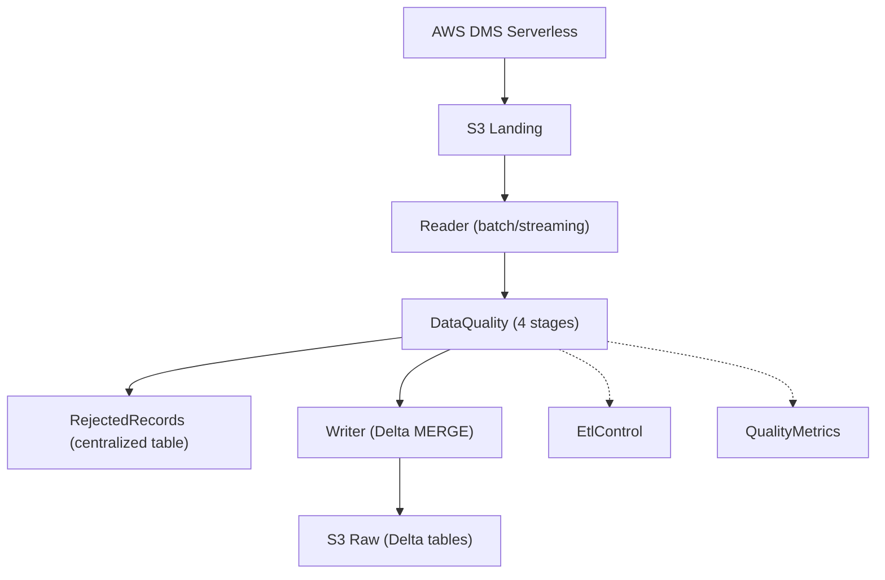

# Product Requirements Document (PRD)

## 1. Objective

Build a **CDC (Change Data Capture)** data processing pipeline for the flight-radar tables in the Data Lake, using **AWS Glue 5.0 (PySpark 4.0)** with **batch + streaming mini-batch** processing (pure Spark — no Glue APIs), ensuring quality, traceability and low latency.

## 2. Problem

Data replicated by DMS in the landing bucket needs to be processed before it's ready for analytical consumption. Currently:
- Raw data in the landing bucket without schema validation
- No quality tracking for ingested data
- No rejection process for invalid records
- No checkpointing for processing recovery
- Need for enriched schema for the `etl_control` control table

## 3. Functional Requirements

### FR01 — Batch + Streaming Read (no Glue APIs)
- Job must read Parquet files from DMS in the landing bucket
- **Batch mode:** `spark.read.format("parquet").load(source_location)` — reads all full-load files
- **Streaming mode:** `spark.readStream` with `maxFilesPerTrigger=1000`, `cleanSource=archive`, `sourceArchiveDir`, `includeExistingFiles=true`, reading the CDC-only prefix (`cdc_source_location`)
- S3 checkpoint via `cleanSource=archive` (no Glue job bookmarks)
- `pathGlobFilter=2*.parquet` to only read CDC files (excludes full load LOAD*.parquet)

### FR02 — Dynamic JSON Configuration (single file)
- Single JSON file on S3:
  - **config.json**: unified configuration (list of tables, each with embedded source + target)
- Job reads the file at runtime using Python **dataclasses**
- Schema must include types (string, double, bigint, etc.), partition_keys, primary_key, enum_columns

### FR03 — Data Quality (4 stages)
- Validation pipeline with 4 stages:
  1. **Cast types** — converts columns according to target schema
  2. **Null check** — filters nulls in NOT NULL fields
  3. **Enum validation** — validates `enum_columns` values
  4. **Timestamp validation** — validates timestamps (pass-through, reserved)
- **No explicit dedup** — uniqueness guaranteed by Delta MERGE on write
- Record quality metrics in `data_quality_metrics` via `QualityMetrics` class

### FR04 — Record Rejection
- Records that fail validation must be saved to centralized `rejected_records` table
- Each rejected record must include metadata: `execution_id`, `execution_timestamp`, `source_database`, `source_table`, `target_database`, `target_table`, `reject_rule`, `reject_reason`, `rejected_record_json`, `reference_date`
- Rejected records stored as JSON payload in single column for schema flexibility
- Partitioned by `reference_date` for query performance

### FR05 — Data Lake Write (Delta Lake)
- Format: **Delta Lake** for valid data (rejects in Parquet)
- Partitioning by `event_date` (derived from timestamp column) or `aircraft_icao24` for high-volume positions table
- Write via **Delta MERGE** based on PK, resolved via the Glue Data Catalog (`DeltaTable.forName`)
- Generate `cod_unique` (PK concatenation) as merge key
- Bootstrap the physical Delta table on first write; MERGE on subsequent writes
- Map DMS CDC columns (`Op` / `dms_timestamp`) to catalog names (`cdc_operation` / `cdc_timestamp`)
- **No compaction needed** — Delta Lake manages optimization via auto-optimize
- Support writing rejects via `RejectedRecords.write()` (Parquet format)

### FR06 — Traceability (EtlControl)
- Separate `EtlControl` class to write metadata to `etl_control`
- Schema: execution_id, job_name, source, execution_start, execution_end, status, records_read, records_written, records_rejected, target_partition, error_message, reference_date
- Writes to the `db_raw.etl_control` catalog table via Parquet append with partitionBy

### FR07 — Orchestration with Separate Components
- `Processor` as the central coordinating class:
  1. `Config.from_s3()` — load configurations
  2. `Reader.read(source, mode)` — batch/streaming read
  3. `DataQuality.validate(df, target, source)` — validation
  4. `RejectedRecords.write()` — write rejects to centralized table
  5. `Writer.write(valid_df, target, source)` — write valid data
  6. `EtlControl.register(...)` — execution log
  7. `QualityMetrics.save(target, ...)` — quality metrics

### FR08 — Infrastructure as Code
- Complete Terraform module in `infra/` with:
  - KMS key for Glue job data encryption
  - Glue Security Configuration (SSE-KMS for CloudWatch, CSE-KMS for job bookmarks, SSE-KMS for S3)
  - Glue Connection type NETWORK for VPC access
  - Glue Job with Spark configs passed via `--conf` (AQE, shuffle, memory, compression)
  - `data.archive_file.helpers` + `aws_s3_object.*` for declarative upload of Python scripts, JSON configs and Lambda source to S3
  - Glue artifacts deployed under `aws-glue/jobs/flight-radar/` and Lambda under `aws-lambda/flight-radar/start_workflow/` in the workspace bucket
  - Glue Catalog databases and tables are **not created** — they already exist in the Data Lake

### FR09 — Lambda Starter (outside the Glue src)
- Lambda source kept in `app/aws-lambda/start_workflow/`, outside the `app/aws-glue/src/` Glue job source
- Invoked on a **schedule** (EventBridge `rate()` rule) — polls the DMS replication task status
- Starts the full-load Glue workflow only when the full-load phase completes (`FullLoadProgressPercent == 100` and `TablesLoading == 0`)
- Uses a **DynamoDB lock** (conditional `attribute_not_exists` on the task ARN) to guarantee a single start per full load
- Native Glue sequencing (on-demand + conditional triggers) starts streaming after the batch succeeds

### FR10 — Dynamic Spark Configs (--conf)
- Spark configs defined in Terraform (`locals.spark_properties`) and converted to `--conf` string
- `main.py` parses the `--conf` argument via `_parse_conf()` and applies each property dynamically to `SparkSession.builder`
- No Spark values hardcoded in Python code — fully configurable via Terraform
- Structured logging with CloudWatch

### FR11 — Spark Optimization Configs
- AQE (Adaptive Query Execution) enabled
- Executor and driver memory settings (4g each, 2g overhead)
- Off-heap memory enabled (2g)
- Dynamic allocation with shuffle tracking
- Shuffle and parallelism settings (200 partitions)
- Snappy compression
- File discovery optimizations (maxPartitionBytes, openCostInBytes, etc.)
- Delta auto-optimize (optimizeWrite / autoCompact)

### FR12 — Tests
- Unit tests with **pytest** mocking Spark and AWS services
- Integration tests with **boto3** validating S3, Glue Catalog and data

### FR13 — Deploy and Rollback via Scripts
- `ci-cd/deploy.sh`: provision AWS environment via Terraform (artifact upload done by Terraform)
- `ci-cd/rollback.sh`: destroy Terraform resources (no S3 cleanup)

### Pipeline Flow (Mermaid)



## 4. Non-Functional Requirements

| ID | Requirement | Description |
|----|-----------|-----------|
| NFR01 | Latency | Processing in mini-batches up to 60s |
| NFR02 | Scalability | Job must scale horizontally with Spark 4.0 + AQE |
| NFR03 | Fault tolerance | S3 checkpointing for automatic recovery |
| NFR04 | Cost | Use spot instances when possible (FLEX execution class) |
| NFR05 | Security | Data encrypted with KMS, IAM least-privilege |
| NFR06 | Pure Spark | No Glue APIs used (GlueContext, DynamicFrame, Job) |
| NFR07 | Maintainability | Modular code with dataclasses, type hints and separate classes |
| NFR08 | Testability | Unit tests with mock and real integration tests |

## 5. Technology Stack

| Component | Technology |
|------------|-----------|
| Processing | **AWS Glue 5.0** (PySpark 4.0) |
| Language | Python 3.9 with dataclasses and type hints |
| Storage | Amazon S3 (Delta Lake for target / Parquet for rejects) |
| Catalog | AWS Glue Data Catalog |
| Orchestration | Glue Workflow + Triggers / EventBridge |
| Monitoring | CloudWatch Logs + Metrics |
| Infrastructure | Terraform (IaC) |
| Unit Tests | pytest + unittest.mock |
| Integration Tests | pytest + boto3 |
| Security | AWS KMS + IAM + Lake Formation |

## 6. Success Metrics

| Metric | Target |
|---------|------|
| Records processed/min | ≥ 10,000 |
| Validity rate | ≥ 99% |
| End-to-end latency | < 120s |
| Unit test coverage | ≥ 100% |
| Job uptime | ≥ 99.9% |
| Validation coverage | 100% of schema columns |

## 7. Stakeholders

- **Data Engineering**: Implementation and maintenance
- **Analytics**: Consumption of data from raw layer tables
- **Data Governance**: Data quality and lineage
- **FinOps**: Cost optimization

## 8. Detailed Table Configurations

### 8.1 Source Tables (from DMS / Aurora PostgreSQL `flight_radar` schema)

| Source | Order | Full Load Path | CDC Path | Checkpoint Path | Archive Path |
|--------|-------|----------------|----------|-----------------|--------------|
| aircraft | 1 | `s3://lakehouse-landing-{account_id}/dms/flightradar/flight_radar/aircraft/LOAD*.parquet` | `s3://lakehouse-landing-{account_id}/dms/flightradar/flight_radar/aircraft/2*/*/*/*/*.parquet` | `s3://lakehouse-workspace-{account_id}/checkpoints/aircraft/` | `s3://lakehouse-landing-{account_id}/dms/flightradar/flight_radar/aircraft_archive/` |
| airports | 2 | `.../airports/LOAD*.parquet` | `.../airports/2*/*/*/*/*.parquet` | `.../checkpoints/airports/` | `.../airports_archive/` |
| airlines | 3 | `.../airlines/LOAD*.parquet` | `.../airlines/2*/*/*/*/*.parquet` | `.../checkpoints/airlines/` | `.../airlines_archive/` |
| flights | 4 | `.../flights/LOAD*.parquet` | `.../flights/2*/*/*/*/*.parquet` | `.../checkpoints/flights/` | `.../flights_archive/` |
| aircraft_positions | 5 | `.../aircraft_positions_2026_*/LOAD*.parquet` | `.../aircraft_positions_2*/2*/*/*/*/*.parquet` | `.../checkpoints/aircraft_positions/` | `.../aircraft_positions_archive/` |
| countries | 6 | `.../countries/LOAD*.parquet` | `.../countries/2*/*/*/*/*.parquet` | `.../checkpoints/countries/` | `.../countries_archive/` |
| aircraft_types | 7 | `.../aircraft_types/LOAD*.parquet` | `.../aircraft_types/2*/*/*/*/*.parquet` | `.../checkpoints/aircraft_types/` | `.../aircraft_types_archive/` |
| routes | 8 | `.../routes/LOAD*.parquet` | `.../routes/2*/*/*/*/*.parquet` | `.../checkpoints/routes/` | `.../routes_archive/` |

### 8.2 Target Tables (in `db_raw`)

| Target Table | Partition Key(s) | Primary Key | Enum Columns |
|-------------|------------------|-------------|--------------|
| `fr_aircraft` | `event_date` (date) | `icao24` | — |
| `fr_airports` | `event_date` (date) | `icao_code` | — |
| `fr_airlines` | `event_date` (date) | `icao_code` | — |
| `fr_flights` | `event_date` (from `scheduled_departure`) | `flight_id` | `status`: [scheduled, active, landed, cancelled, diverted] |
| `fr_aircraft_positions` | `aircraft_icao24` (string) | `position_id`, `recorded_at` | — |
| `fr_countries` | `event_date` (date) | `id` | — |
| `fr_aircraft_types` | `event_date` (date) | `icao_code` | — |
| `fr_routes` | `event_date` (date) | `id` | — |

### 8.3 Control Tables

| Table | Database | Partition | Description |
|-------|----------|-----------|-------------|
| `etl_control` | `db_raw` | `reference_date` | Job execution tracking |
| `data_quality_metrics` | `db_raw` | `reference_date` | Quality metrics per execution |
| `rejected_records` | `db_raw` | `reference_date` | Centralized rejected records with JSON payload |

## 9. CDC Behavior Details

- **Full load** (`LOAD*.parquet`): initial snapshot with `Op` = `I`
- **Incremental CDC**: files with maximum interval of **60 seconds**
- `Op` = `I` (insert), `U` (update), `D` (delete)
- `dms_timestamp` marks the moment of change capture
- DMS `CdcPath` parameterizes the S3 prefix for CDC files, ensuring the streaming job does not reprocess full load files
- `preserve_transactions = false` → each record is independent (no transactional grouping)

## 10. Delta MERGE Logic

```python
# When CDC operation column is present:
WHEN NOT MATCHED AND Op <> 'D' THEN INSERT
WHEN MATCHED AND Op = 'D' THEN DELETE
WHEN MATCHED THEN UPDATE

# When no CDC operation column (full load only):
WHEN NOT MATCHED THEN INSERT
WHEN MATCHED THEN UPDATE
```

## 11. Spark Configs (defined in Terraform locals.tf)

All configs passed via `--conf` and applied dynamically in `main.py`:

```python
# Delta Lake extensions and catalog
spark.sql.extensions = io.delta.sql.DeltaSparkSessionExtension
spark.sql.catalog.spark_catalog = org.apache.spark.sql.delta.catalog.DeltaCatalog
spark.sql.catalogImplementation = hive
spark.hadoop.hive.metastore.client.factory.class = com.amazonaws.glue.catalog.metastore.AWSGlueDataCatalogHiveClientFactory

# File discovery
spark.sql.files.maxPartitionBytes = 256MB
spark.sql.files.openCostInBytes = 32MB
spark.sql.files.maxPartitionNum = 2000
spark.sql.sources.parallelPartitionDiscovery.threshold = 32
spark.sql.sources.parallelPartitionDiscovery.parallelism = 10000
spark.sql.parquet.filterPushdown = true
spark.sql.parquet.enableVectorizedReader = true

# Adaptive Query Execution
spark.sql.adaptive.enabled = true
spark.sql.adaptive.coalescePartitions.enabled = true
spark.sql.adaptive.advisoryPartitionSizeInBytes = 128MB

# Delta Lake writes and compression
spark.databricks.delta.optimizeWrite.enabled = true
spark.databricks.delta.autoCompact.enabled = true
spark.databricks.delta.autoCompact.minNumFiles = 10
spark.databricks.delta.autoCompact.maxFileSize = 134217728
spark.sql.parquet.compression.codec = snappy
```