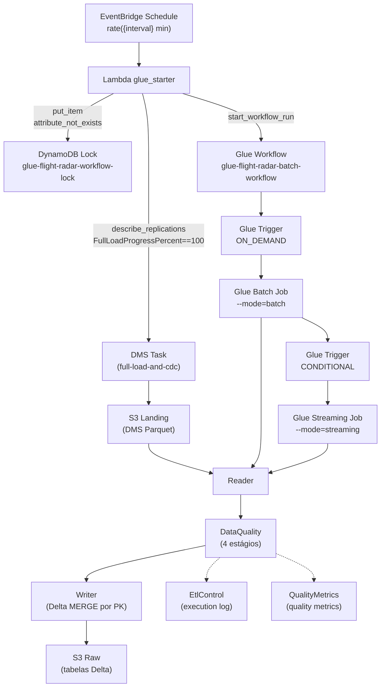

# Skill: Glue Streaming Mini-Batch with DMS CDC

## Purpose
Implement an **AWS Glue 5.0 (PySpark 4.0)** job to process **CDC (Change Data Capture)** data replicated by **AWS DMS Serverless** in the **landing** bucket — the `flight_radar` tables — apply quality rules, and write to the **Data Lake** (raw layer) in **Delta Lake** format.

## Technology Stack

| Component | Version |
|------------|--------|
| AWS Glue | **5.0** |
| Apache Spark | **4.0** |
| Python | **3.9** |
| Format | **Delta Lake** (target) / Parquet (rejects) |
| Tests | pytest + boto3 (integration) |
| Glue APIs | **NOT used** (pure Spark) |

## Job Architecture

### Diagrama de Arquitetura (Mermaid)



## Infrastructure (Terraform)

The Terraform module in `infra/` manages all required AWS resources, organized by service:

| Resource | File | Description |
|---------|------|-----------|
| `aws_kms_key.glue` | `kms.tf` | KMS key for SSE-KMS/CSE-KMS encryption |
| `aws_glue_security_configuration.glue` | `glue.tf` | Security config (CloudWatch, bookmarks, S3) |
| `aws_glue_connection.vpc` | `glue.tf` | VPC connection (private subnet, default security group) |
| `aws_glue_workflow.dms_full_load` | `glue.tf` | Glue workflow orchestrating full load → streaming |
| `aws_glue_job.full_load_batch` | `glue.tf` | Full-load batch Glue job (Glue 5.0, Spark 4.0, Python 3.9) |
| `aws_glue_job.streaming_minibatch` | `glue.tf` | Streaming CDC Glue job (Glue 5.0, Spark 4.0, Python 3.9) |
| `aws_glue_trigger.start_streaming_after_full_load` | `glue.tf` | CONDITIONAL trigger — starts streaming after batch |
| `aws_iam_role.lambda_glue_starter` + policy | `iam.tf` | IAM role/policy for Lambda → Glue |
| `aws_lambda_function.glue_starter` + permission | `lambda.tf` | Lambda that starts the full-load workflow (EventBridge schedule target) |
| `aws_cloudwatch_event_rule.full_load_complete` + target | `cloudwatch.tf` | EventBridge schedule rule/target — polls DMS task status until full load completes |
| `aws_dynamodb_table.workflow_lock` | `dynamodb.tf` | DynamoDB lock keyed by task ARN — single workflow start per full load |
| `data.archive_file.helpers` + `aws_s3_object.*` | `s3.tf` | Creates helpers.zip and declarative upload of main.py, config.json and Lambda source to the workspace bucket |

> ⚠️ Glue Catalog databases and tables are not managed by this module — they already exist in the Data Lake.

### Dynamic Spark Configs

Spark configs are defined in `locals.tf` as a `spark_properties` map and converted to a `--conf` string (format `key=value key=value ...`). `main.py` parses this string via `_parse_conf()` and applies each property dynamically to `SparkSession.builder`, with no hardcoded values.

Data sources: IAM role `role-datalake-analytics`, default VPC, subnets, security group.

## Componentes

### 1. `main.py` — Entry Point
- Initializes pure `SparkSession` (no GlueContext, no Glue Job API)
- Parses arguments: `--config_s3_path`, `--conf`, `--mode` (batch|streaming)
- Applies **Spark optimization configs** dynamically via `--conf`
- Batch mode: processes N tables **sequentially** (`order` field)
- Streaming mode: starts **N concurrent queries** (one per table) with `trigger(processingTime="5 minutes")`
- Instantiates the `Processor` class and executes the pipeline in each micro-batch

### 2. `config_models.py` — Configuration Models (dataclasses)
- Defines dataclasses for `SchemaField`, `PartitionKey`, `CdcConfig`, `TargetConfig`, `SourceConfig`, `Config`
- Reads a **single** `config.json` with all tables (embedded source + target)
- `SourceConfig`: `source`, `order`, `source_location`, `cdc_source_location`, `format`, `cdc_config`, `checkpoint_location`, `target`
- `TargetConfig`: `catalog` (database, table), `location`, `rejected_location`, `format`, `compression`, `partition_keys`, `schema`, `primary_key`, `enum_columns`, `cod_unico_expr`
- `Config`: `sources` (list sorted by `order`), methods `from_file()` (local) and `from_s3()` (S3)

### 3. `Reader` — Data Reading (batch + streaming)
- Reads Parquet files from S3 (DMS CDC) in **batch** or **streaming** mode
- **Streaming:** uses `spark.readStream` with `cleanSource=archive`, `sourceArchiveDir`, `includeExistingFiles=false`, reading the CDC-only prefix
- **Batch:** uses `spark.read.format("parquet").load()` to read all existing full-load files
- `maxFilesPerTrigger=1` for micro-batch control
- Returns raw Spark `DataFrame`

### 4. `data_quality.py` — Quality and Validation
- Receives raw DataFrame and target schema (from `TargetConfig`)
- 4-stage pipeline:
  1. **Cast types** — converts columns according to target schema
  2. **Null check** — filters nulls in NOT NULL fields
  3. **Enum validation** — validates `enum_columns` values
  4. **Timestamp validation** — validates timestamps (pass-through)
- **No explicit dedup** — uniqueness guaranteed by Delta MERGE on write (Writer)
- **Invalid** records are written to `Rejected/` with metadata (`_reject_table`, `_reject_rule`, `_reject_timestamp`)
- Returns tuple: `(valid DataFrame, rejects DataFrame)`
- **Dynamic operation**: reads schema from JSON config, allowing validation of any source without code changes

### 5. `writer.py` — Data Lake Write (Delta Lake)
- Receives valid DataFrame and target table metadata
- Generates `cod_unico` column via `F.concat_ws("_", *pk_cols)` for merge key
- Writes in **Delta Lake** format to the **raw** bucket
- Resolves the table by path (`DeltaTable.forPath`) and performs **Delta MERGE** based on composite PK for cross-batch uniqueness
- Bootstraps the physical Delta table on first write; MERGE on subsequent writes
- Maps DMS CDC columns (`Op` / `dms_timestamp`) to catalog names (`cdc_operation` / `cdc_timestamp`)
- Partitions data by `event_date` (derived from timestamp column via `F.to_date()`)
- **No compaction needed** — Delta Lake manages optimization automatically via auto-optimize
- Supports writing rejects with `write_rejects()` (Parquet format)

### 6. `etl_control.py` — Execution Log
- Separate class responsible for writing metadata to the `etl_control` table
- Records: `execution_id`, `job_name`, `source`, `execution_start`, `execution_end`, `status`, `records_read`, `records_written`, `records_rejected`, `target_partition`, `error_message`, `reference_date`
- Resolves S3 paths and account_id dynamically via `boto3`

### 7. `quality_metrics.py` — Quality Metrics
- Separate class responsible for saving metrics to `data_quality_metrics`
- Records: `database`, `table`, `processing_timestamp`, `metric`, `rule`, `status`, `failure_reason`, `partition`, `technology`, `reference_date`
- Uses `SparkSession` to write partitioned Parquet to the raw layer

### 8. `processor.py` — Orchestrator
- Coordinates the full pipeline: Config → Reader → DataQuality → Writer → EtlControl → QualityMetrics
- Method `run(source, target)` executes the pipeline: Read → Validate → Write Rejects → Write (Delta MERGE) → Register → Metrics
- Delegates `_register_execution` to `EtlControl` and `_save_quality_metrics` to `QualityMetrics`

### 9. Lambda — `app/aws-lambda/start_workflow/start_glue_job.py`
- Kept **outside** `app/aws-glue/src`, separate from the Glue job source
- Invoked on a **schedule** (EventBridge `rate()` rule) — polls the DMS replication task status
- Starts the workflow only when the full-load phase completes (`FullLoadProgressPercent == 100` and `TablesLoading == 0`)
- Uses a **DynamoDB lock** (conditional `attribute_not_exists` on the task ARN) to guarantee a single start per full load
- Starts the full-load Glue workflow via `glue.start_workflow_run()`
- Native Glue sequencing (on-demand + conditional triggers) starts streaming after the batch succeeds — no polling in the Lambda

## Deployment Structure (Workspace Bucket)

```
lakehouse-workspace-{account_id}/
├── aws-glue/jobs/flight-radar/src/
│   ├── main.py
│   └── dependencies/
│       ├── helpers.zip
│       └── config/config.json
└── aws-lambda/flight-radar/start_workflow/
    └── start_glue_job.py
```

## Spark Optimization Configs

Spark configs are defined in `infra/locals.tf` in the `spark_properties` map:

- `spark.sql.adaptive.enabled` = true (AQE)
- `spark.sql.adaptive.coalescePartitions.enabled` = true
- `spark.sql.adaptive.skewJoin.enabled` = true
- `spark.sql.adaptive.advisoryPartitionSizeInBytes` = 128MB
- `spark.sql.shuffle.partitions` = 200
- `spark.sql.parquet.compression.codec` = snappy
- `spark.executor.memory` = 4g
- `spark.driver.memory` = 4g
- `spark.executor.memoryOverhead` = 2g
- `spark.driver.memoryOverhead` = 2g
- `spark.memory.offHeap.enabled` = true
- `spark.memory.offHeap.size` = 2g
- `spark.dynamicAllocation.enabled` = true
- `spark.dynamicAllocation.shuffleTracking.enabled` = true
- Delta auto-optimize (optimizeWrite / autoCompact) + Delta catalog extension

## Data Lake Conventions

| Layer | Bucket | Database | Format |
|--------|--------|----------|---------|
| Landing | `lakehouse-landing-{account_id}` | — | Parquet (DMS) |
| Raw | `lakehouse-raw-{account_id}` | `db_raw` | **Delta Lake** (target) / Parquet (rejects) |
| Workspace | `lakehouse-workspace-{account_id}` | — | Scripts, configs, checkpoints |

## Involved Tables

| Table | Purpose | Partitions |
|--------|-----------|-----------|
| `tbl_aircraft` | Aircraft registry | `event_date` |
| `tbl_airports` | Airports | `event_date` |
| `tbl_airlines` | Airlines | `event_date` |
| `tbl_flights` | Flights fact table | `event_date` |
| `tbl_aircraft_positions` | Positions (high volume) | `event_date` |
| `tbl_countries` | Countries | `event_date` |
| `tbl_aircraft_types` | Aircraft types | `event_date` |
| `tbl_routes` | Routes | `event_date` |
| `etl_control` | Glue Job execution control | `reference_date` |
| `data_quality_metrics` | Quality metrics | `reference_date` |

## Glue Job Parameters

| Parameter | Description | Example |
|-----------|-----------|---------|
| `--config_s3_path` | S3 path to unified config.json (all tables) | `s3://.../aws-glue/jobs/flight-radar/src/dependencies/config/config.json` |
| `--mode` | Execution mode: `batch` or `streaming` | `batch` |
| `--conf` | Dynamic Spark configs (key=val key=val ...) | `spark.sql.shuffle.partitions=200 ...` |

## IAM Role
`role-datalake-analytics` — minimum permissions to read landing, write raw, access Glue Catalog and KMS.