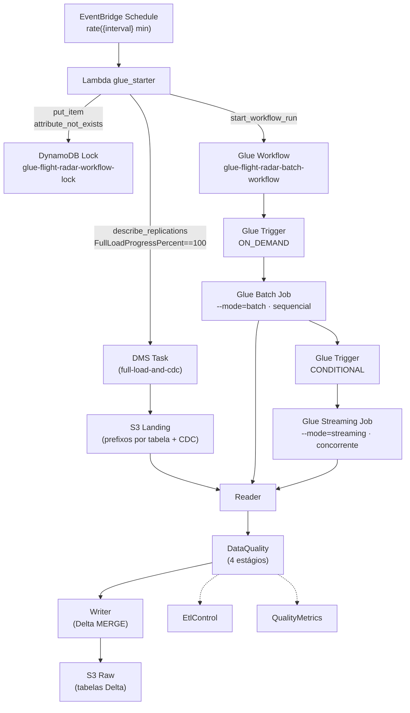
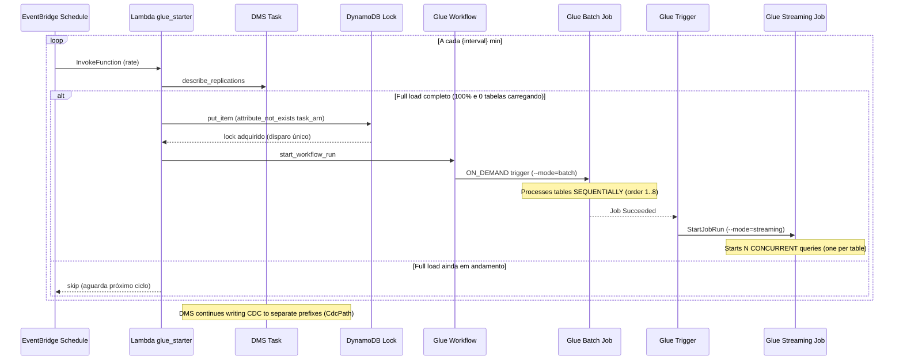

# Specification — Glue Batch + Streaming DMS CDC

## 1. Overview

CDC (Change Data Capture) processing pipeline using **AWS Glue 5.0 (PySpark 4.0)** with **pure Spark** (no GlueContext, DynamicFrame, or Job API). Operates in **two modes**:

- **Batch mode (full load):** Runs when DMS completes the initial load. Processes all tables **sequentially** in the order defined by the `order` field in config.json.
- **Streaming mode (CDC):** Runs continuously after the full load. Starts **N concurrent queries** (one per table), each reading its CDC prefix via `readStream` with `forEachBatch`.

Both modes share the same `main.py` script, differentiated by the `--mode` parameter.

### Technology Stack

| Component | Version |
|------------|--------|
| AWS Glue | 5.0 |
| Apache Spark | 4.0 |
| Python | 3.9 |
| Format | **Delta Lake** (target) / Parquet (rejects) |
| Infrastructure | Terraform ≥ 1.5 |
| Tests | pytest + boto3 |

## 2. Architecture

### Diagrama de Arquitetura (Mermaid)



## 3. Components

### 3.1. Config — `app/aws-glue/src/dependencies/config_models.py` (+ `config/` JSON)

**Dataclasses:**
- `SchemaField(name, type, comment, nullable)`
- `PartitionKey(name, type, source_column)`
- `CdcConfig(op_column, timestamp_column, delete_strategy)`
- `SourceConfig(source, order, source_location, cdc_source_location, archive_location, format, filter, cdc_config, checkpoint_location, target)`
- `TargetConfig(catalog, format, compression, partition_keys, schema, primary_key, enum_columns, cod_unique_expr)`
- `Config` with `_sources: List[SourceConfig]`, `source` property (first), `sources` (all, sorted by order), `get_source(name)` method, and `from_files()`, `from_s3()`, `to_dict()` methods

**Configuration files:**
| File | Purpose | Content |
|---------|-----------|----------|
| `app/aws-glue/src/dependencies/config/config.json` | Unified configuration | List of tables with embedded source + target |

### 3.2. Reader — `app/aws-glue/src/dependencies/reader.py`

- Method `read(source, mode="streaming")` — dispatcher for batch or streaming mode
- **Streaming mode:** `spark.readStream.format("parquet")` with `maxFilesPerTrigger=1000`, `cleanSource=archive`, `sourceArchiveDir`, `includeExistingFiles=true`, reading from `source.cdc_source_location` (CDC-only prefix), `pathGlobFilter=2*.parquet`
- **Batch mode:** `spark.read.format("parquet").load(source.source_location)` — reads all existing full-load files
- S3 checkpoint (`source.checkpoint_location`) — streaming only
- Schema inference for `aircraft_positions` table (FIXED_LEN_BYTE_ARRAY handling)
- Filter support via `source.filter`

### 3.3. AwsHelper — `app/aws-glue/src/dependencies/aws_helper.py`

- Reusable boto3 utility class, decoupled from the pipeline
- Lazy clients: `s3`, `athena`, `glue`, `sts`, `cloudwatch`
- `get_account_id()` → returns account ID via STS
- `run_athena_query(spark, query, database, workgroup, location)` → executes Athena query and returns Spark DataFrame
- `move_s3_objects(source_bucket, source_prefix, dest_bucket, dest_prefix, pattern, delete_source)` → moves S3 objects with regex filter
- `put_metric(namespace, metric_name, value, unit, dimensions)` → publishes CloudWatch metric
- `get_json_from_s3(s3_path)` → loads and parses JSON from S3
- `get_table_location(database, table)` → gets S3 location of Glue Catalog table
- `update_table_partitions(database, table)` → discovers S3 partitions and creates missing ones in Glue Catalog via `batch_create_partition`

### 3.4. DataQuality — `app/aws-glue/src/dependencies/data_quality.py`

- 4-stage pipeline executed on raw DataFrame
- Uses `TargetConfig` schema for dynamic validation
- **No explicit dedup** — uniqueness guaranteed by Delta MERGE on write
- Rejected records enriched with `_reject_table`, `_reject_rule`, `_reject_timestamp`
- Returns `(valid_df, rejects_df)`

**Stages:**

| Stage | Method | Description |
|-------|--------|-----------|
| 1 | `_cast_types` | Converts columns to target schema types (Spark types) |
| 2 | `_check_nulls` | Removes records with nulls in required (non-nullable) fields |
| 3 | `_check_enums` | Validates values against allowed list in `enum_columns` |
| 4 | `_validate_timestamps` | Pass-through (reserved for future timestamp validation) |

### 3.5. Writer — `app/aws-glue/src/dependencies/writer.py`

- **Delta Lake** write resolved via the Glue Data Catalog with `DeltaTable.forName()`
- Generates `cod_unique` via `F.concat_ws("_", *pk_cols)` for merge key
- Derives `event_date` via `F.to_date(F.col(timestamp_col))`
- Bootstraps the physical Delta table (`_delta_log`) via `save(path)` on first write, then MERGE on subsequent writes
- Maps DMS CDC short names (`Op` / `dms_timestamp`) to catalog column names (`cdc_operation` / `cdc_timestamp`) via `_map_cdc_columns`
- MERGE logic:
  - `WHEN NOT MATCHED AND Op <> 'D' THEN INSERT`
  - `WHEN MATCHED AND Op = 'D' THEN DELETE`
  - `WHEN MATCHED THEN UPDATE`
- **No manual compaction** — Delta manages via auto-optimize
- `write_rejects()` for rejected records (Parquet format)
- Partition columns selected from target schema + partition keys

### 3.6. RejectedRecords — `app/aws-glue/src/dependencies/rejected_records.py`

- Centralized rejected records writer to `db_raw.rejected_records`
- Single table for all entities with JSON payload column (`rejected_record_json`)
- Metadata columns: `execution_id`, `execution_timestamp`, `source_database`, `source_table`, `target_database`, `target_table`, `reject_rule`, `reject_reason`, `reference_date`
- Append-only write to S3 with `partitionBy("reference_date")`
- Updates Glue Catalog partitions after write via `update_table_partitions`

### 3.7. EtlControl — `app/aws-glue/src/dependencies/etl_control.py`

- Separate class for registering in `etl_control`
- Method `register(execution_id, source_name, status, records_read, records_written, records_rejected, target, elapsed_seconds, error_message)`
- Writes to the `db_raw.etl_control` catalog table via `saveAsTable` (Parquet, partitioned by `reference_date`)
- Schema: execution_id, job_name, source, execution_start, execution_end, status, records_read, records_written, records_rejected, target_partition, error_message, reference_date

### 3.8. QualityMetrics — `app/aws-glue/src/dependencies/quality_metrics.py`

- Separate class for metrics in `data_quality_metrics`
- Method `save(target, status, records_read, records_written, records_rejected)`
- Writes to the `db_raw.data_quality_metrics` catalog table via `saveAsTable` (Parquet, partitioned by `reference_date`)
- Schema: database, table, processing_timestamp, metric, rule, status, failure_reason, partition, technology, reference_date

### 3.9. Processor — `app/aws-glue/src/dependencies/processor.py`

- Pipeline orchestrator
- Method `run(source, target, mode="streaming", dataframe=None)`
- In batch mode with pre-read `dataframe`, skips the read step
- 7-stage pipeline:
  1. Read via Reader (or uses pre-read DataFrame in batch mode)
  2. DataQuality.validate()
  3. RejectedRecords.write() rejects
  4. Writer.write() valid data
  5. EtlControl.register()
  6. QualityMetrics.save()
  7. Logging

### 3.10. Main — `app/aws-glue/src/main.py`

- Argument parsing via `argparse`: `--config_s3_path`, `--conf`, `--mode` (batch|streaming), `--generate-test-rejects`
- `main()`: loads config (`Config.from_s3(args.config_s3_path)`), gets sorted list via `config.sources`, dispatches `_run_batch()` or `_run_streaming()`
- `_run_batch()`: iterates sources in `order`, reads batch of each table and processes via `Processor.run(mode="batch", dataframe=raw_df)`. Errors in one table do not block the others (fail-fast on first error).
- `_run_streaming()`: starts **one streaming query per table**, each with `trigger(processingTime="5 minutes")` and own checkpoint. `awaitAnyTermination()` keeps the job alive. Fail-fast on any query failure.
- `_parse_conf()` converts string "key=val key=val" to dict
- `_init_spark()` uses `SparkSession.builder.appName("glue-flight-radar").getOrCreate()` to attach to runtime session with `--conf` already applied
- `_enable_streaming_debug_logs()` enables DEBUG logging for streaming packages

### 3.11. Lambda — `app/aws-lambda/start_workflow/start_glue_job.py`

- Lives **outside** `app/aws-glue/src` (kept separate from the Glue job source)
- Invoked on a **schedule** (EventBridge `rate()` rule) — polls the DMS replication task status
- Queries `describe_replications` and starts the workflow only when the full-load phase completes (`FullLoadProgressPercent == 100` and `TablesLoading == 0`)
- Uses a **DynamoDB lock** (`glue-flight-radar-workflow-lock`, conditional `attribute_not_exists` on the task ARN) to guarantee a single workflow start per full load
- Starts the full-load Glue workflow via `glue.start_workflow_run()`
- The workflow uses native Glue sequencing (on-demand + conditional triggers) to start streaming after the batch succeeds, avoiding polling and concurrent writes

## 4. Infrastructure (Terraform)

### Resources (organized by service in `infra/`)

| Name | File | Type | Description |
|------|------|------|-----------|
| `aws_kms_key.glue` | `kms.tf` | KMS Key | SSE-KMS/CSE-KMS encryption, 30-day rotation |
| `aws_kms_alias.glue` | `kms.tf` | KMS Alias | `alias/glue-flight-radar` |
| `aws_glue_security_configuration.glue` | `glue.tf` | Security Config | CloudWatch SSE-KMS, bookmarks CSE-KMS, S3 SSE-KMS |
| `aws_glue_connection.vpc` | `glue.tf` | Glue Connection | NETWORK, private subnet, default SG |
| `aws_glue_job.full_load_batch` | `glue.tf` | Glue Job (batch) | `glue-flight-radar-batch` — Glue 5.0, Python 3.9, `--mode=batch` — processes N tables sequentially |
| `aws_glue_job.streaming_minibatch` | `glue.tf` | Glue Job (streaming) | `glue-flight-radar-streaming` — Glue 5.0, Python 3.9, `--mode=streaming` — N concurrent queries |
| `aws_glue_workflow.dms_full_load` | `glue.tf` | Glue Workflow | `glue-flight-radar-batch-workflow` — orchestrates full load → streaming |
| `aws_glue_trigger.start_full_load` | `glue.tf` | Glue Trigger | ON_DEMAND — starts the batch job on workflow run |
| `aws_glue_trigger.start_streaming_after_full_load` | `glue.tf` | Glue Trigger | CONDITIONAL — starts streaming CDC after batch succeed |
| `aws_iam_role.glue_job` | `iam.tf` | IAM Role | Dedicated role `role-glue-job-flight-radar` for Glue jobs and sessions |
| `aws_iam_role_policy.glue_catalog_connections` | `iam.tf` | IAM Policy | Glue GetConnection/GetConnections |
| `aws_iam_role_policy.glue_catalog_tables` | `iam.tf` | IAM Policy | Glue Catalog tables/partitions access |
| `aws_iam_role_policy.glue_data_access` | `iam.tf` | IAM Policy | S3 (landing, raw, workspace), KMS, CloudWatch Logs, CloudWatch Metrics |
| `aws_iam_role_policy.glue_vpc_networking` | `iam.tf` | IAM Policy | EC2 Describe/Create/Delete Network Interfaces |
| `aws_iam_role_policy.glue_interactive_sessions` | `iam.tf` | IAM Policy | Glue interactive sessions + PassRole |
| `aws_iam_group_policy.interactive_sessions_passrole` | `iam.tf` | IAM Policy | datalake-admins group PassRole for sessions |
| `aws_iam_role.lambda_glue_starter` | `iam.tf` | IAM Role | Role for Lambda to start the full-load workflow |
| `aws_iam_role_policy.lambda_glue_starter` | `iam.tf` | IAM Policy | Glue StartWorkflowRun, DMS DescribeReplications, DynamoDB GetItem/PutItem, CloudWatch Logs |
| `aws_lambda_function.glue_starter` | `lambda.tf` | Lambda Function | Starts the full-load Glue workflow (EventBridge schedule target) |
| `aws_lambda_permission.eventbridge_invoke_glue_starter` | `lambda.tf` | Lambda Permission | Allows EventBridge to invoke the Lambda |
| `aws_cloudwatch_event_rule.full_load_complete` | `cloudwatch.tf` | EventBridge Rule | Schedule `rate()` — polls DMS task status until full load completes |
| `aws_cloudwatch_event_target.start_glue_batch` | `cloudwatch.tf` | EventBridge Target | Triggers the Lambda via InvokeFunction |
| `aws_dynamodb_table.workflow_lock` | `dynamodb.tf` | DynamoDB Table | Lock keyed by task ARN — guarantees single workflow start per full load |
| `data.archive_file.helpers` | `s3.tf` | Archive Data | Creates helpers.zip from `app/aws-glue/` (contains the `src` package) |
| `aws_s3_object.main_py` | `s3.tf` | S3 Object | Uploads `main.py` to `aws-glue/jobs/flight-radar/src/` |
| `aws_s3_object.helpers_zip` | `s3.tf` | S3 Object | Uploads `helpers.zip` to `aws-glue/jobs/flight-radar/src/dependencies/` |
| `aws_s3_object.config_json` | `s3.tf` | S3 Object | Uploads `config.json` (with `{account_id}` resolved) to `aws-glue/jobs/flight-radar/src/dependencies/config/` |
| `aws_s3_object.lambda_start_glue_job` | `s3.tf` | S3 Object | Uploads Lambda source to `aws-lambda/flight-radar/start_workflow/` |

### Deployment Structure (Workspace Bucket)

Artifacts are published to the workspace bucket mirroring the project layout:

```
lakehouse-workspace-{account_id}/
├── aws-glue/jobs/flight-radar/src/
│   ├── main.py
│   └── dependencies/
│       ├── helpers.zip
│       └── config/config.json
└── aws-lambda/flight-radar/start_workflow/
    └── start_glue_job.py
```

The Glue job is named for a **single objective** (`glue_job_name = glue-flight-radar`).
Two job definitions are derived from it and differentiated by process in code/classes via the `--mode` argument:
- `glue-flight-radar-batch` — full load (`--mode=batch`)
- `glue-flight-radar-streaming` — streaming CDC (`--mode=streaming`)

### Dynamic Spark Configs (`locals.tf → spark_conf`)

```hcl
spark_properties = {
  # Delta Lake extensions and catalog (REQUIRED for Delta tables via Glue Catalog)
  "spark.sql.extensions"                             = "io.delta.sql.DeltaSparkSessionExtension"
  "spark.sql.catalog.spark_catalog"                  = "org.apache.spark.sql.delta.catalog.DeltaCatalog"
  "spark.sql.catalogImplementation"                  = "hive"
  "spark.hadoop.hive.metastore.client.factory.class" = "com.amazonaws.glue.catalog.metastore.AWSGlueDataCatalogHiveClientFactory"

  # File discovery and small-file grouping during reads
  "spark.sql.files.maxPartitionBytes"                        = "256MB"
  "spark.sql.files.openCostInBytes"                          = "32MB"
  "spark.sql.files.maxPartitionNum"                          = "2000"
  "spark.sql.sources.parallelPartitionDiscovery.threshold"   = "32"
  "spark.sql.sources.parallelPartitionDiscovery.parallelism" = "10000"
  "spark.sql.parquet.filterPushdown"                         = "true"
  "spark.sql.parquet.enableVectorizedReader"                 = "true"

  # General adaptive execution
  "spark.sql.adaptive.enabled"                      = "true"
  "spark.sql.adaptive.coalescePartitions.enabled"   = "true"
  "spark.sql.adaptive.advisoryPartitionSizeInBytes" = "128MB"

  # Delta writes, compression and automatic small-file compaction
  "spark.databricks.delta.optimizeWrite.enabled"   = "true"
  "spark.databricks.delta.autoCompact.enabled"     = "true"
  "spark.databricks.delta.autoCompact.minNumFiles" = "10"
  "spark.databricks.delta.autoCompact.maxFileSize" = "134217728"
  "spark.sql.parquet.compression.codec"            = "snappy"
}
```

### Existing Data Sources

- IAM Role: `role-glue-job-flight-radar` (dedicated, created by this module)
- VPC: default (`vpc-022139f6bee3cbdd5`)
- Subnets: private in us-east-1a/b/c
- Security Group: default (`sg-0f885f9d1473a7777`)

> ⚠️ Glue Catalog databases and tables are not managed by this module.

## 5. Scripts

### `ci-cd/deploy.sh`

- Checks prerequisites (Terraform, AWS CLI, jq)
- Initializes Terraform (local state)
- Selects workspace (`-e ENV`)
- Applies Terraform (artifact upload is done by `aws_s3_object` resources)

### `ci-cd/rollback.sh`

- Confirms rollback (or `--yes`)
- Runs `terraform destroy`
- Does **not** remove S3 files

## 6. Glue Job Parameters

| Parameter | Description | Required | Default |
|-----------|-------------|-------------|---------|
| `--config_s3_path` | S3 path to config.json (all tables with source + target) | Yes | — |
| `--conf` | Spark configs (key=val key=val) | No | "" |
| `--mode` | Execution mode: `batch` (sequential) \| `streaming` (concurrent) | No | `streaming` |
| `--generate-test-rejects` | Generate test rejected records | No | `true` |

## 7. Data Lake Tables

| Table | Database | Purpose | Partition |
|--------|----------|-----------|----------|
| `fr_aircraft` | `db_raw` | Aircraft registry | `event_date` |
| `fr_airports` | `db_raw` | Airports | `event_date` |
| `fr_airlines` | `db_raw` | Airlines | `event_date` |
| `fr_flights` | `db_raw` | Flights fact table | `event_date` (from `scheduled_departure`) |
| `fr_aircraft_positions` | `db_raw` | Positions (high volume) | `aircraft_icao24` |
| `fr_countries` | `db_raw` | Countries | `event_date` |
| `fr_aircraft_types` | `db_raw` | Aircraft types | `event_date` |
| `fr_routes` | `db_raw` | Routes | `event_date` |
| `etl_control` | `db_raw` | Execution control | `reference_date` |
| `data_quality_metrics` | `db_raw` | Quality metrics | `reference_date` |
| `rejected_records` | `db_raw` | Centralized rejected records | `reference_date` |

## 8. Conventions

- **Buckets**: named with account ID: `lakehouse-{tier}-{account_id}`
- **Format**: Delta Lake (target) + Snappy; Parquet for rejects
- **IAM**: role `role-glue-job-flight-radar` (dedicated, created by this module)
- **Spark**: pure Spark, no Glue APIs
- **Configs**: unified config.json (8 tables with embedded source + target)
- **Streaming + Batch**: same `main.py` script, differentiated by `--mode`
- **Bookmarks**: not used (uses `cleanSource=archive`)
- **Separate S3 prefixes**: DMS `CdcPath` writes CDC to a distinct prefix to avoid reprocessing
- **Two job definitions**: batch and streaming — share the same script
- **Deploy layout**: Glue artifacts under `aws-glue/jobs/flight-radar/` and Lambda under `aws-lambda/flight-radar/start_workflow/` in the workspace bucket
- **Lambda location**: source in `app/aws-lambda/start_workflow/`, outside `app/aws-glue/src/`
- **Execution class**: FLEX for both jobs
- **Worker types**: G.1X (batch: 4 workers, streaming: 2 workers)

## 9. Event Flow



## 10. Data Quality

4-stage pipeline in `DataQuality`:

| Stage | Function | Description |
|-------|--------|-----------|
| 1 | `_cast_types` | Converts columns to target schema types |
| 2 | `_check_nulls` | Removes records with nulls in required fields |
| 3 | `_check_enums` | Validates values against allowed list in `enum_columns` |
| 4 | `_validate_timestamps` | Validates timestamps (current pass-through) |

## 11. Tests

### Unit (`tests/unit/`)
- `test_config.py`: from_files, from_s3, to_dict, invalid JSON
- `test_reader.py`: streaming read, checkpoint config, schema
- `test_data_quality.py`: 4 stages, rejects, types, enums, nulls
- `test_writer.py`: Delta write, partitions, rejects, bootstrap
- `test_processor.py`: full mocked pipeline
- `test_rejected_records.py`: centralized rejected records

### Integration (`tests/integration/`)
- `conftest.py`: boto3 fixtures (S3, Glue)
- `test_s3_landing.py`: landing bucket structure
- `test_glue_catalog.py`: databases and tables existence
- `test_pipeline_e2e.py`: complete pipeline with real data